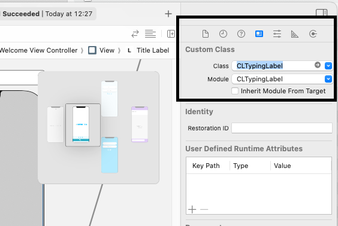
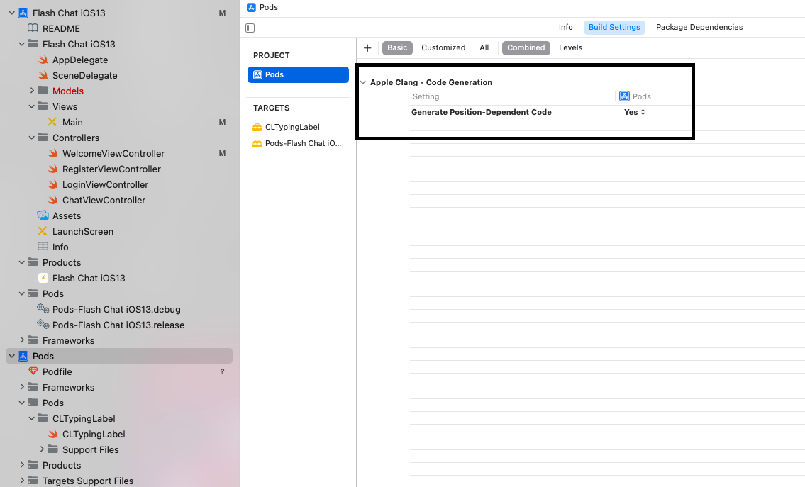

# Cocoapods

[https://cocoapods.org](https://cocoapods.org)

## Install Cocoapods

```
$ sudo gem install cocoapods
$ pod setup --verbose
// check if OK

pod --version
```

## Get Started in Project

Search for pods (above). Then list the dependencies in a text file named Podfile in your Xcode project directory:

**Tip: CocoaPods provides a <u>pod init</u> command to create a Podfile with smart defaults. You should use it.**

```
$ pod init
```

```
platform :ios, '13.0'
use_frameworks!

target 'MyApp' do
  pod 'AFNetworking', '~> 2.6'
  pod 'ORStackView', '~> 3.0'
  pod 'SwiftyJSON', '~> 2.3'
end
```

## Install dependencies

Now you can install the dependencies in your project:

```
$ pod install
```

Make sure to always open the Xcode workspace instead of the project file when building your project:

```
$ open App.xcworkspace
```

Build project:

```
CMD + B
```


## In Project: 

1. If it is related with UI, change class in inspector, e.g. from UILabel to CLTypingLabel:




Now you can import your dependencies e.g.:

```
#import CLTypingLabel
```

Change UILabel in code: 

```
// from 
@IBOutlet weak var titleLabel: UILabel!
// to 
@IBOutlet weak var titleLabel: CLTypingLabel!

```

## Potential problems
* Switch to **Yes**




## Removing Pod 

1. Reverse everything in Project
2. delete pod line in you **pod file**
3. go to terminal and run **pod install**

