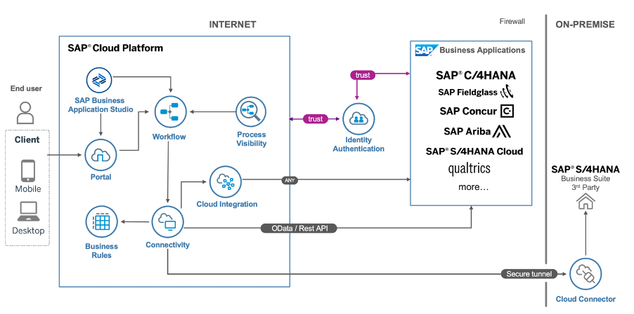
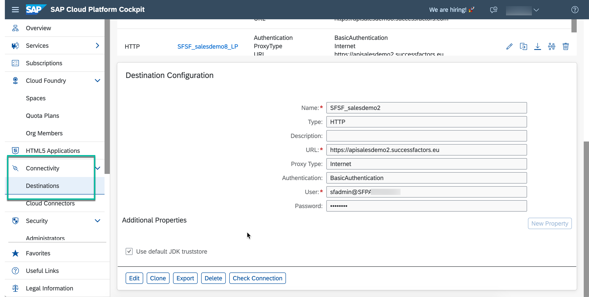
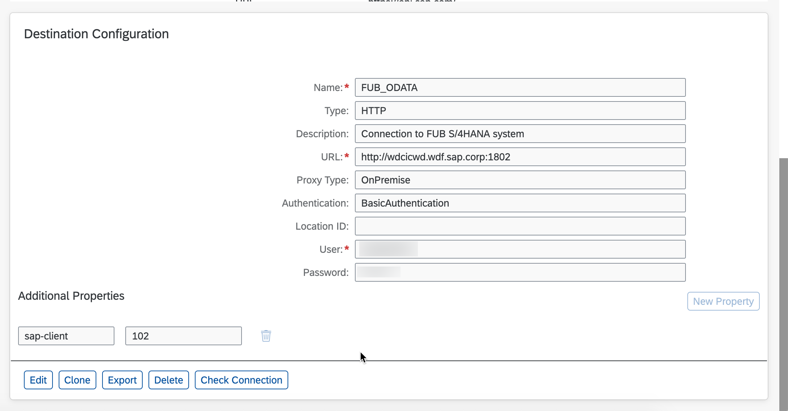
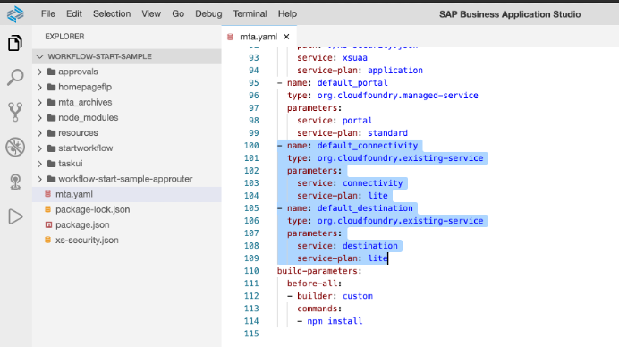
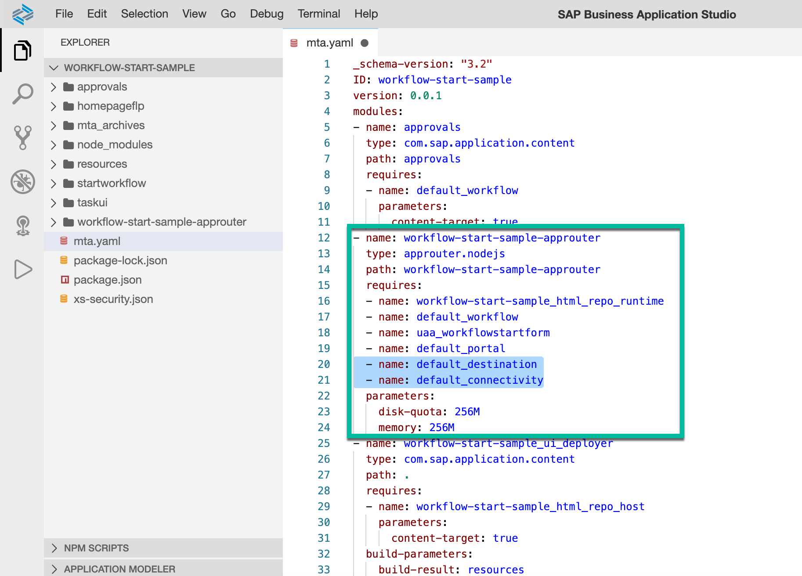
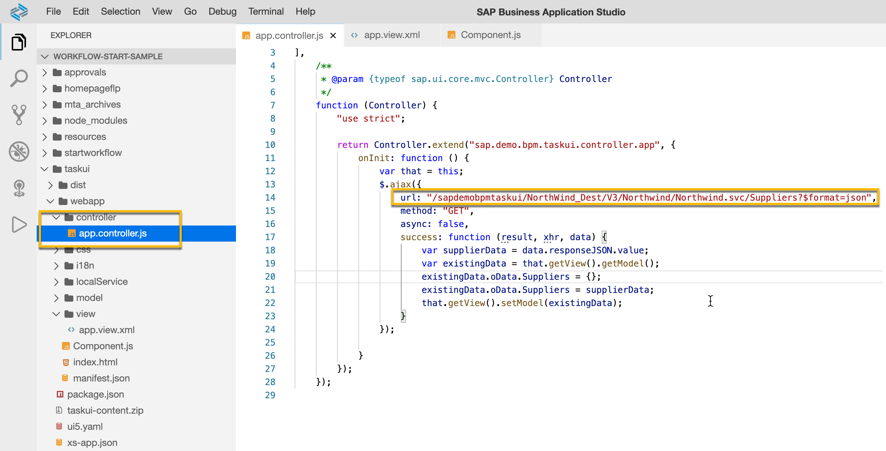

# SAP Build Process Automation

## How to set Custom UI


## Calling External API in Custom Task UI of WF in Cloud Foundry



### Prerequisite
- MTA created
- Fiori module created


### Process
### 1. Create destination (at sub-account level)
    -  e.g.: Success Factors with Basic Authorization



    - e.g.: S/4HANA  with Basic Authorization




### 2. Upadte xs-app.json of Fiori Application
- create a destination route in xs-app.json, eg: 
```
{
     "source": "^/NorthWind_Dest/(.*)$",
     "target": "/$1",
     "destination": "northwind",
     "authenticationType": "none"
}
```

### 3. Update mta.yaml of MTA project

As you are trying to access the destination from CF application, you therefore need to add the dependency of destination service and/or connectivity service instance to the app-router from where you are accessing the My Inbox application.

<i>Note 1: If you are accessing internet based destination then you need only destination service instance dependency. </i>

<i>Note 2: If you are using on-premise based destination then you also have to use connectivity service instance together with destination service.</i>


For the 1st Note: add the service instance details in the resources section




Then add the dependency of the destination and/or connectivity service instance in the app-router.



<i>
<b>Caution:</b> if you miss this step then the Component.js of your user task UI wont load and you will get 500 – Internal Server Error as the app-router will try and look for the destination.</i>


***
<i>

cdm.js:66 2020-09-07 23:55:46.422770 Cannot create componentsap.demo.bpm.taskui for smart template rendering. Showing standard task in the detail screen as a fallback: failed to load ‘sap/demo/bpm/taskui/Component.js’ from /sapdemobpmtaskui/Component.js: 500 – Internal Server Error
</i>
***


### 4. Code Fiori Application to call External API

In the final step, you now have to code your Fiori application to call the needed service.



<i>Note the URL. It has application ID followed by the route name and then the relative URL </i>
```
/<applicationID>/<route-name>/<relative-URL>
```

- application ID cen be found in manifest.json under "sap.app" and "id"


<i>Note: </i> If you are using SAP managed app-router based application then prefix be as follows:

```
    /<app-modulepath>/<route-name>/<relative-URL>

    e.g.: /workflow-sample.sapdemobpmtaskui-1.0.0/Northwind_dest/Northwind.svc/Suppliers
```
<i>You can use this code to get the module path: </i>
```
var appId = this.getOwnerComponent().getManifestEntry("/sap.app/id");
var appPath = appId.replaceAll(".","/");
var appModulePath = jQuery.sap.getModulePath(appPath);
```


### Resources
- [Calling External API In Custom Task UI of Workflow in Cloud Foundry](https://blogs.sap.com/2020/09/08/calling-external-api-in-custom-task-ui-of-workflow-in-cloud-foundry/)