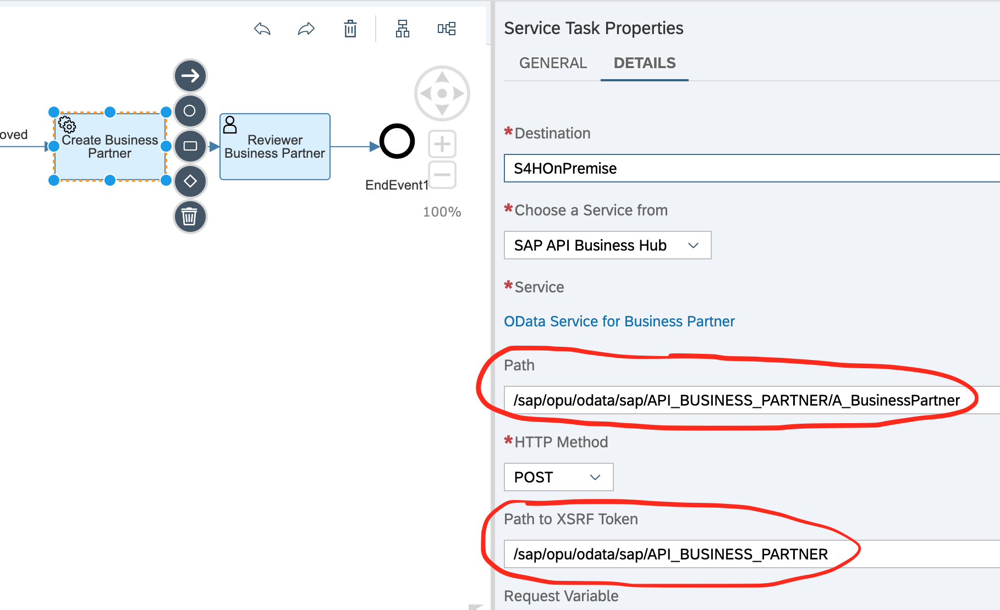

# How to get csrf token for POST calls

- XSRF token is needed in 2 instances (a) when you are calling any API from the application which is routed via app-router and (b) when you making an on-premise API call

- For on-premise API call if there are no specific XSRF token URL then you can use the same API URL as for POST, GET etc. see the image below

