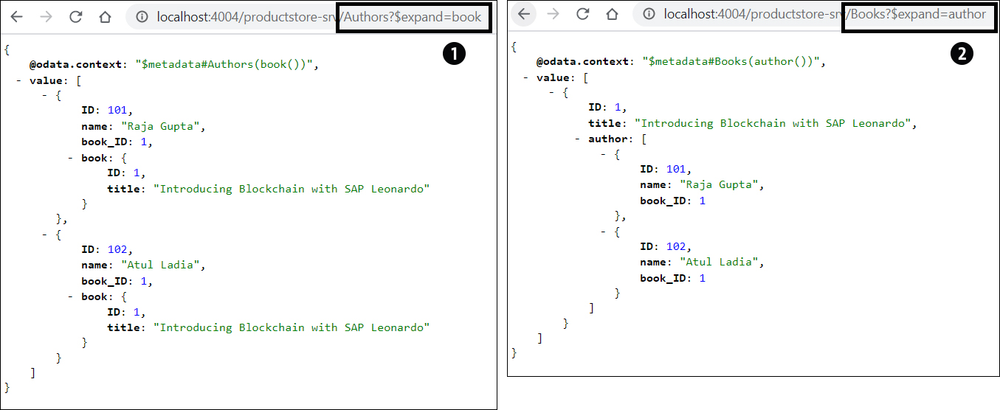

# SAP BTP CAPM


What is CAPM: Lib + Language + Tools + Framework

- CAPM is a generic runtime that hooks CDS and allow developers to extend and customize through Express or Spring
- CAPM is domain-driven design
    - some principles of domain-driven design
        - Clean modeling: Don't fill your model with technical detail
        - Concise modeling: use short names an simple , flat models
        - Comprehensible modeling
- Defining a Schema - produce entities


### Some benefits and reqs of CAPM
- The application should explicitly declare and isolate dependencies (SQLite, SAP HANA, NPM packages)
- The application should have proper logging implemented
- Should be properly modularized a microservice architecture
- The application should support a RESTful architecture and provide services in OData format
- The application should support multi-tenancy
          
# Content

| Topic                                                  | Description               |
|--------------------------------------------------------|---------------------------|
| [Setup](./sub/sap-btp-cap-setup.md )                               | Setup CAPM Env            |
| [Project](#CAPM_Project)                               | Set CAPM Project          |
| [CDS](#CAPM_CDS)                                       | CAPM CDS                  |
| [Association & composition](#Association_Composition) | Association & Composition |
| [Query](#Query)                                        | CAPM Query                |
| [References](#Reference)                               | URL References            |


-----


### Deployment Dependencies
- install support for local role teesting on your CDS server with the npm module Passport
    - install by: ```npm i -g passport```
- Cloud MTA Build Tool
    - install by: ```npm i -g mbt```
    - verify by: ```mbt``` in terminal
- Cloud Foundry CLI
    - if it is installed already, uninstall it first and then install newer version
        - uninstall by: ```cf uninstall-plugin multiapps```
    - install by: ```cf install-plugin multiapps```

-------

// Refactor and create new Sub-Section

### Some CDS Commands
* cds help
* cds init
* cds deploy
    * cds deploy --to hana
    * cds deploy --to sqlite
    * cds deploy --to sqlite:db/book-service.db
* cds serve
* cds compile
    * cds compile products.cds --to json
    * cds compile products.cds --to sql
    * cds compile products.cds --to hana
    * cds compile products.cds --to yaml
* cds watch

[<- Back to Content](#content)
 

------


## CAPM_Project

[<- Back to Content](#content)

### Create CAPM project
- ```cds init <folder name>```
- ```cd <folder name>```

### Running CAPM project
- install dependencies by: ```npm install```
- start CDS server by: ```cds watch```


* https://localhost:4004 should open

### Define Services

### Entity:
- An entity is a distinct object containing a set number of CDS elements
- You can also refer to an entity as a table or a design-time file
- represent data with primary keys

### Element
- An element is a property, specifically a property in relation to an entity
- And element can be a simple key and type, or you can apply element modifiers to specify that it is a key or default value

### Type
- A descriptor of the CDS element describing the primitive type (e.g.: string or integer)

The following code defines an example entity:

```
entity Car : {
    brand : String;
    model : String;
    buildDate : Date;
    color : String;
    weight : Integer; 
}

```

* create ```cds``` file in ```srv``` folder, e.g.:
```
service say {
    function hello (to: String) returns String;
    
}
```


### Implement Services (in Node.js)
- it is possible to use ```Express.js``` or ```JS ES6 classes```
- ```Express.js``` is recommended way
- with ```JS ES6 classes``` there are some restriction, like only registering only one handler per event event
- to implement the service, you must create a JS file to match your service definition
- create same file as cds but with ```.js``` extension in the same folder

```
module.exports = (say) => {
    say.on("hello", req => `Hello ${req.data.to}!`);
}
``` 

### Consuming Services
```
http://localhost:4004/say/hello(to='readers')

```

[<- Back to Content](#content)

----

## CAPM_CDS

[<- Back to Content](#content)


### Custom types & Enums
```
namespace db.example;

type Rating: Integer enum {
    Best = 5;
    Good = 4;
    Average = 3;
    Poor = 2;
    Worst = 1;
}

type Amount {
    value: Decimal(10,3);
    currency: Currency; 
}

// usage of a type & enum


entity Products {
    key ID: Integer;
    title : String;
    rating: Rating; 
    price : Amount;
}

```


### Aspects

* Aspects in CDS helps enhance modularity by allowing you to group behaviors into manageable parts that can be used by multiple entities.
* In example, ```managedBy``` is an aspect further used in the <b>Products</b> entity
* DB for <b>Products</b> would be 4 columns

```
aspect managedBy{
    createdAt: Timestamp;
    createdBy: String;
}

entity Products: managedBy{
    key ID : Integer;
    title: String;
}
```

### Views
* Entities can be further exposed as other entities using
    * ```as select from``` OR
    * ```as projection on```
* These new entities are mapped to an SQL view in the database
* The difference is
    * ```as select from ``` can be used with joins, SQL clauses, unions.
    * ```as projection on ``` can not be used with SQL

```
entity Products as select from Products;
entity Products as select from Products where ID = 1;
entity Products as projection on Products;
```

### Service Definitions

* You can define a service in CDS by exposing entities enclosed in a service block

```
service ProductService{
    entity Products as projection on Products;
    entity Product_1 as select from Products where ID = 1;
}
```


[<- Back to Content](#content)

----

## Association_Composition

[<- Back to Content](#content)

You'll use it to maintain relationships between entities


## Associations
* In an association, all objects have their own lifecycles, and there is no ownership.
* e.g.: A book can be associated with one or more authors.

### Unmanaged Associations
* In unmanaged Association, you'll specify the join clause using a foreign key.

```
entity Books {
    key ID: Integer; 
    title: String;
    author_ID: Integer;  // foreign key to Authors
    author : Association to Authors on author.ID = author_ID;
}

entity Authors {
    key ID: Integer;
    name : String;
}
```

In OData it looks like this:


----

### Managed-to-One Associations

* In a managed-to-one association, you aren't specifying a join clause
* CDS automatically resolves and adds the required foreign key elements from the target entity's primary key
* This example is equivalent to the unmanaged association example shown earlier except that foreign key Author_ID is automatically added to the Books entity when CDS model is deployed to the DB

```
// Managed-to-one Associations
entity Books {
    key ID: Integer;
    title: String;
    author: Association to Authors;
}

entity Authors {
    key ID: Integer;
    name: String;
}

```

###  Managed-to-Many Associations
* one book is associated with one or more authors
* Authors entity contains a backlink (e.g. book), which is specified in the Books entity by using the ```on``` operator

```
entity Books {
    key ID : Integer;
    title: String;
    author: Association to many Authors on author.book = $self;
}

entity Authors {
    key ID: Integer;
    name: String;
    book: Association to Books; // backlink
}
```


-----

### Compositions

* A composition is a special type of association between two entities when one entity owns other entity
* A child entity cannot exist if its parent entity dies. (death relationship)
* e.g.: book and the cover of the book

```
entity Books {
    key ID: Integer;
    title: String;
    bookCovers: Composition of many BookCovers on bookCovers.book = $self; 
}

entity BookCovers {
    key ID: Integer;
    imageName: String;
    book: Association to Books;  // backlink
}
```

* Generated OData is also similar to the managed to-many association
* except: OnDeleteAction="Cascade"


[<- Back to Content](#content)

----

## Query

[<- Back to Content](#content)


CDS Query Language (CQL or CDS QL) is an extension of SQL and upgrades SQL with some really handy features:
- postfix projections
- path expressions
- CDL-Style Casts

### Postfix Projections
CQL allows you to put a SELECT clause behind a FROM clause, enclosed in curly braces.

```
// this has same effect
    Select ID, title from Products;
    Select from Products {ID, title};
```


### Path Expressions

You can use path expressions to navigate along associations and structured elements

```
SELECT from SalesInvoice[ID=1].Products;
```


### CDL-Style Casts

CDS does not support SQL-style type cast. Instead, you can use CDL-style casts.

```
Select from Products {price+100 as NewPrice : Decimal};
```


[<- Back to Content](#content)

-----

## Reference:

[<- Back to Content](#content)
- [cloud-cap-samples](https://github.com/SAP-samples/cloud-cap-samples/tree/main)
- [GitHUb - SAP Cloud Application Programming Model](https://github.com/cap-js)
- [Sending Notifications from SAP BTP Applications to the SAP Fiori Launchpad](https://www.youtube.com/watch?v=PZPp1gyLLQo)
- [Create Freestyle Fiori App on CAPM BTP SAP Fiori App development on Business application studio BAS](https://www.youtube.com/watch?v=vxoZlkZ-gCM)
- [Create a SAP Fiori App using OData and Deploy it to SAP BTP](https://www.youtube.com/watch?v=9kdldvuBF9k)
- [09 CAPM Create Fiori App BTP Training | Build and Deploy Your SAP Fiori App to BTP](https://www.youtube.com/watch?v=Y0Zz3girtWc)
- [10 CAPM Fiori UI Annotations | Create UI with Annotation in SAP® CAPM](https://www.youtube.com/watch?v=NMCUO19DD5I)
- [11 SAP BTP Use S4HANA Sales Service | Create a Service Instance to Consume the SAP S4HANA Cloud APIs](https://www.youtube.com/watch?v=SK5t8yyC8sA)
- [Making CAP Application Development Easier and Faster with the Help of Storyboard in SAP Business Application Studio](https://blogs.sap.com/2023/09/20/making-cap-application-development-easier-and-faster-with-the-help-of-storyboard-in-sap-business-application-studio/)

- [Working with Modeling Content in a Project](https://learning.sap.com/learning-journey/modeling-in-sap-hana-cloud/working-with-modeling-content-in-a-project)
- [SAP Business Technology Platform Showcase: Access SAP HANA Cloud Database Underneath SAP Data Warehouse Cloud](https://github.com/SAP-samples/btp-showcase-actuals-cap)
- [SAP Business Application Studio for SAP Fiori Development - Introduction and Exercise 1](https://www.youtube.com/watch?v=VFLFp_pHYJQ)
- [Start Developing in SAP BTP](https://developers.sap.com/mission.scp-1-start-developing.html)
- [Connect to Third-Party Services Using SAP Integration Suite](https://developers.sap.com/mission.apim-open-connectors.html)
- [Combine CAP with SAP HANA Cloud to Create Full-Stack Applications](https://developers.sap.com/mission.hana-cloud-cap.html)
- [SAP Business Technology Platform ABAP Environment](https://community.sap.com/topics/btp-abap-environment)
- [SAP Cloud SDK](https://sap.github.io/cloud-sdk/docs/js/features/odata/execute-odata-request)
- [SAP-samples/s4hana-btp-extension-devops](https://github.com/SAP-samples/s4hana-btp-extension-devops)
- [SAP/business-partner-sample-app-s4hana-cloud](https://github.com/SAP/business-partner-sample-app-s4hana-cloud)
- [SAP-samples/s4hana-btp-extension-devops](https://github.com/SAP-samples/s4hana-btp-extension-devops)
- [MTA CLoudTool](https://sap.github.io/cloud-mta-build-tool/)
- [Create an App Using SAP Cloud SDK for JavaScript](https://developers.sap.com/group.s4sdk-js-cloud-foundry.html)
- [Consuming REST APIs with (Cloud) ABAP](https://blogs.sap.com/2020/10/27/consuming-rest-apis-with-cloud-abap/)
- [Level Up with SAP BTP, ABAP Environment](https://developers.sap.com/mission.abap-env-level-up.html)
- [Create an XSUAA Instance](https://help.sap.com/viewer/65de2977205c403bbc107264b8eccf4b/Cloud/en-US/2ce1a962c3be48dd8035513b0a2d7397.html)
- [Create business partner in S/4HANA Cloud using ABAP Environment data](https://developers.sap.com/tutorials/abap-environment-business-partner.html)
- [Step 4 with SAP Cloud SDK: Calling an OData Service with the Virtual Data Model](https://blogs.sap.com/2017/05/21/step-4-with-sap-s4hana-cloud-sdk-calling-an-odata-service/#WriteBusinessPartnerServlet)
- [Build an SAP Fiori App that Consumes Data from an On-Premise System](https://developers.sap.com/group.appstudio-fiori.html)
- [Create OData Entities with the SAP Cloud SDK's Virtual Data Model](https://developers.sap.com/tutorials/cloudsdk-js-vdm-create.html)
- [SAP Tech Bytes: FAQ Managed Approuter vs. Standalone Approuter](https://blogs.sap.com/2021/05/17/sap-tech-bytes-faq-managed-approuter-vs.-standalone-approuter/)
- [CAP](https://cap.cloud.sap/docs/about/)
- [SAP® CAPM | SAP® Cloud Application Programming Model Tutorial | SAP® CAP Model End-to-End](https://www.youtube.com/watch?v=mA5yYLI-byc)
- [Tutorial - Create SAP Cloud Application Programming Model Project for SAP HANA Cloud](https://www.youtube.com/watch?v=ydDOGz7P--8)
- [SAP Cloud Application Programming Model: Consume External Services](https://www.youtube.com/watch?v=rWQFbXFEr1M)
- [SAP® CAPM App in SAP® BAS | SAP ®CAPM Tutorial](https://www.youtube.com/watch?v=svlVsSbxi_E)
- [CAP in a nutshell](https://cap.cloud.sap/docs/get-started/in-a-nutshell)
- [UI5CN Lab](http://www.lab.ui5cn.com/docs/deploy-app-to-scf)
- [Build a Business Application Using CAP for Node.js](https://developers.sap.com/mission.cp-starter-extensions-cap.html)
- [SAP Cloud Application Programming Model](https://community.sap.com/topics/cloud-application-programming)
- [SAP Cloud Application Programming Model (CAP) | SAP Community Call](https://www.youtube.com/watch?v=OQVUkCs7mzY)
- [SAP HANA Cloud and CAP to Build Full-Stack Applications Using VSCode](https://www.youtube.com/watch?v=yceqr9vycrs)
- [Create Calculation View and Expose via CAP (SAP HANA Cloud)](https://developers.sap.com/tutorials/hana-cloud-cap-calc-view.html)
- [Create UI & Integrate OData in UI5 Application on BAS for CAPM Full Stack UI5 Development](https://blogs.sap.com/2022/04/05/create-ui-integrate-odata-in-ui5-application-on-bas-for-capm-full-stack-ui5-development/)
- [Working with Modeling Content in a Project](https://learning.sap.com/learning-journey/modeling-in-sap-hana-cloud/working-with-modeling-content-in-a-project)
- [SAP Business Technology Platform Showcase: Access SAP HANA Cloud Database Underneath SAP Data Warehouse Cloud](https://github.com/SAP-samples/btp-showcase-actuals-cap)
- [Start Developing in SAP BTP](https://developers.sap.com/mission.scp-1-start-developing.html)
- [Connect to Third-Party Services Using SAP Integration Suite](https://developers.sap.com/mission.apim-open-connectors.html)
- [Combine CAP with SAP HANA Cloud to Create Full-Stack Applications](https://developers.sap.com/mission.hana-cloud-cap.html)
- [SAP Business Technology Platform ABAP Environment](https://community.sap.com/topics/btp-abap-environment)
- [SAP Cloud SDK](https://sap.github.io/cloud-sdk/docs/js/features/odata/execute-odata-request)
- [SAP-samples/s4hana-btp-extension-devops](https://github.com/SAP-samples/s4hana-btp-extension-devops)
- [SAP/business-partner-sample-app-s4hana-cloud](https://github.com/SAP/business-partner-sample-app-s4hana-cloud)
- [SAP-samples/s4hana-btp-extension-devops](https://github.com/SAP-samples/s4hana-btp-extension-devops)
- [MTA CLoudTool](https://sap.github.io/cloud-mta-build-tool/)
- [Create an App Using SAP Cloud SDK for JavaScript](https://developers.sap.com/group.s4sdk-js-cloud-foundry.html)
- [Consuming REST APIs with (Cloud) ABAP](https://blogs.sap.com/2020/10/27/consuming-rest-apis-with-cloud-abap/)
- [Level Up with SAP BTP, ABAP Environment](https://developers.sap.com/mission.abap-env-level-up.html)
- [Create an XSUAA Instance](https://help.sap.com/viewer/65de2977205c403bbc107264b8eccf4b/Cloud/en-US/2ce1a962c3be48dd8035513b0a2d7397.html)
- [Create business partner in S/4HANA Cloud using ABAP Environment data](https://developers.sap.com/tutorials/abap-environment-business-partner.html)
- [Step 4 with SAP Cloud SDK: Calling an OData Service with the Virtual Data Model](https://blogs.sap.com/2017/05/21/step-4-with-sap-s4hana-cloud-sdk-calling-an-odata-service/#WriteBusinessPartnerServlet)
- [Build an SAP Fiori App that Consumes Data from an On-Premise System](https://developers.sap.com/group.appstudio-fiori.html)
- [Create OData Entities with the SAP Cloud SDK's Virtual Data Model](https://developers.sap.com/tutorials/cloudsdk-js-vdm-create.html)
- [SAP Tech Bytes: FAQ Managed Approuter vs. Standalone Approuter](https://blogs.sap.com/2021/05/17/sap-tech-bytes-faq-managed-approuter-vs.-standalone-approuter/)
- [Capire repo GitHub](https://github.com/cap-js/docs)

- [Welcome to the CAP SFLIGHT App](https://github.com/SAP-samples/cap-sflight)

- [Service integration with SAP Cloud Application Programming Model](https://github.com/SAP-samples/cap-service-integration-codejam)

- [SAP Business Technology Platform Showcase: Access SAP HANA Cloud Database Underneath SAP Data Warehouse Cloud](https://github.com/SAP-samples/btp-showcase-actuals-cap)

- [cloud-sf-extension-cap-sample](https://github.com/SAP-samples/cloud-sf-extension-cap-sample)

- [Create Automated System Tests for SAP Cloud Application Programming Model Projects](https://developers.sap.com/tutorials/cicd-wdi5-cap.html)

- [teched2020-DEV164](https://github.com/SAP-archive/teched2020-DEV164)
- [Contributions to the SAPUI5 Documentation](https://github.com/SAP-docs/sapui5)

- [Automated System Tests for CAP-Based Projects](https://github.com/SAP-samples/cap-bookshop-wdi5)

- [SAP BTP Developer's Guide](https://github.com/SAP-samples/btp-developer-guide-cap)

- [btp-cap-multitenant-saas](https://github.com/SAP-samples/btp-cap-multitenant-saas)

- [sap-cap-examples](https://github.com/sebastianesch/sap-cap-examples)

- [ui5-typescript](https://github.com/SAP/ui5-typescript)

- [UI5 Language Assistant](https://github.com/SAP/ui5-language-assistant)

- [openSAP-ui5-course](https://github.com/SAP/openSAP-ui5-course)

- [sapui5bin](https://github.com/qmacro/sapui5bin)

- [SAPUI5-Fiori](https://github.com/qmacro/SAPUI5-Fiori)


[<- Back to Content](#content)


