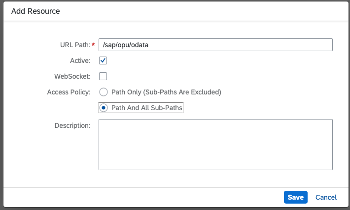

# SAP Cloud Connector to On Premise ABAP - Basic Setup

1. Access https://localhost:8443 (Name “Administrator” and Password “manage”)
2. First you need to change the default password to a new one. You may also need to set a proxy to connect to the internet.
3. Download Cloud Connector Auth Data

4. Upload Auth Data

5. Click Cloud To On-Premise in the left menu, then click the Add button on the right side

6. Select:

7. Add resources: 

