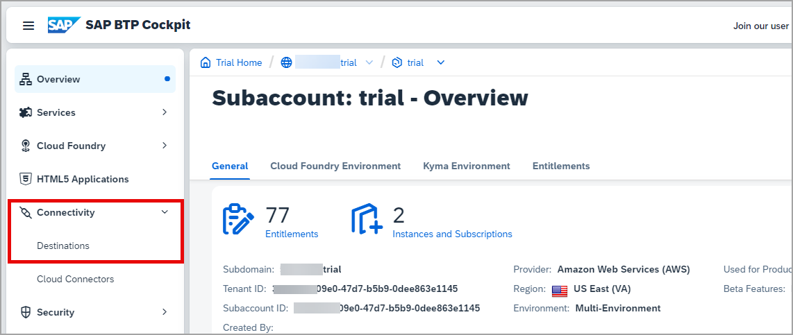
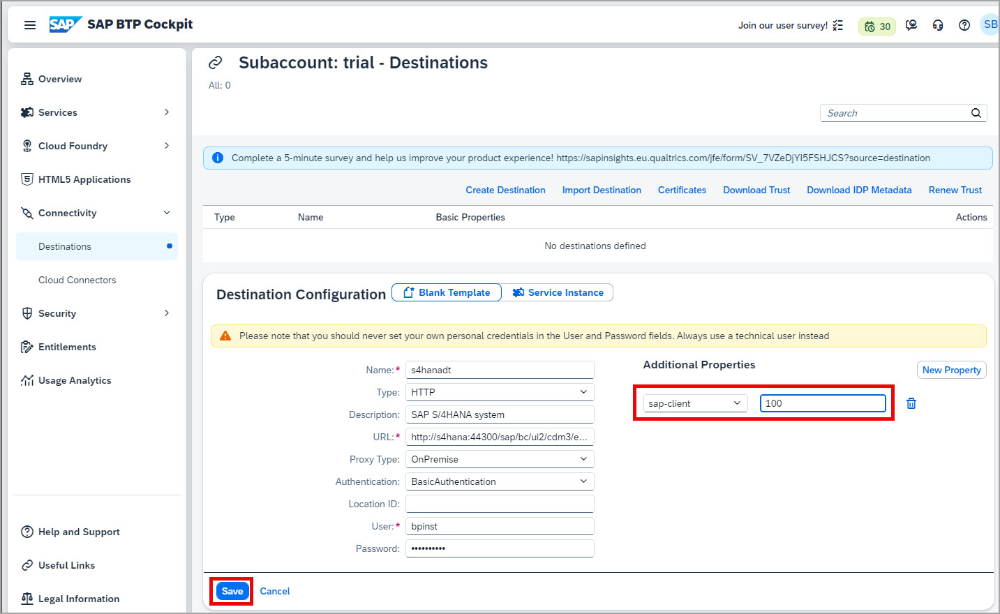

# Create the design-time destination

The design-time destination is used to fetch the federated content from the content provider system during design-time.

1. In the menu, navigate to **Connectivity > Destinations**.

2. Create Destination
 