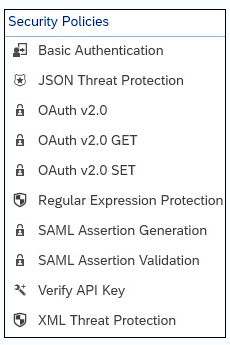

# Security

[<- Back to API Management](../../sap-btp-api-management-readme.md)

SAP API Management already provides an additional security layer to your infrastructure. However, this isn’t where security stops when it comes to APIs.

In addition to out-of-the-box security in SAP API Management, it’s possible to implement security on an API proxy level. In other words, you can use security policies (see figure below) in your API proxy to implement API-specific security.

SAP API Management provides capabilities to define the behavior of an API by using Policies. A Policy is a program that executes a specific function at runtime. They provide the flexibility to add common functionalities on an API without having to code them individually each time.

Policies provide features to secure APIs, control the API traffic, and transform message formats. You can also customize the behavior of an API by adding scripts and attaching them to policies.

You can apply a policy on the **request** or **response** stream. You can also specify if it is applicable on the proxy endpoint or target endpoint. For information on the types of policies supported by API Management, see Policy Types.

## Policies included in SAP API Management Security

* [Basic Auth](./apim-security-basic-authentication.md)
* [JSON Threat Protection](./apim-security-json-threat-protection.md)
* [OAuth](./apim-security-oauth.md)
* [Regular Expression Protection](./apim-security-regular-expr-protection.md)
* [SAML](./apim-security-saml.md)
* [Verify API Key](./apim-security-verify-api-key.md)
* [XML Threat Protection](./apim-security-xml-threat-protection.md)

* Access Control
* Access Entity
* Assign Message
* Extract variables
* Invalidate Cache
* JavaScript
* JSON to XML
* Key Value Map Operations
* Lookup Cache
* Message Logging Policy
* Populate Cache
* Python Script
* Quota
* Raise Fault
* Reset Quota
* Service Callout
* Spike Arrest
* SOAP Message Validation Policy
* XML to JSON
* XSL Transform
* Response Cache
* Statistics Collector Policy

There are many security considerations when utilizing APIs. With SAP API Management, there are seven security policies provided for you to take advantage of. Read more here: [Policy Types](https://help.sap.com/docs/sap-api-management/sap-api-management/policy-types?version=Cloud) and [here](https://community.sap.com/t5/technology-blogs-by-sap/sap-cloud-platform-api-management-api-security-best-practices-blog-series/ba-p/13313891)

## Using Policies

### References

* [Exercise 10 - API policies](https://github.com/SAP-samples/manage-apis-codejam/blob/main/exercises/10-api-policies/README.md)

* [SAP Micro Learning - SAP API Management: Securing your APIs using Policies](https://microlearning.opensap.com/media/SP+PI+Management+Securing+your+PIs+using+Policies/1_rla8fy64)

* [SAP API Management – Policy Management](https://community.sap.com/t5/technology-blogs-by-sap/sap-api-management-policy-management/ba-p/13182049)

* [Integrate SAP API Management with 3rd party IDP for SAML/JWT/OAuth based Authentication](https://www.youtube.com/watch?v=792SHsUWFB0)

* [Secure On-Premise API using SAP API Management in SAP Integration Suite](https://community.sap.com/t5/technology-blogs-by-members/secure-on-premise-api-using-sap-api-management-in-sap-integration-suite/ba-p/13524781)

* [Part 1 - Introduction to API Management](https://community.sap.com/t5/technology-blogs-by-sap/part-1-introduction-to-api-management/ba-p/13298349)

* [API Policies](https://learning.sap.com/learning-journeys/developing-with-sap-integration-suite/using-policies_cd5fde51-b3d2-40d3-bd71-3f2870c2b51b)