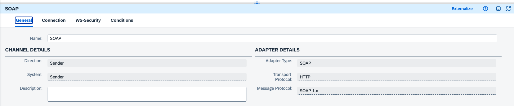
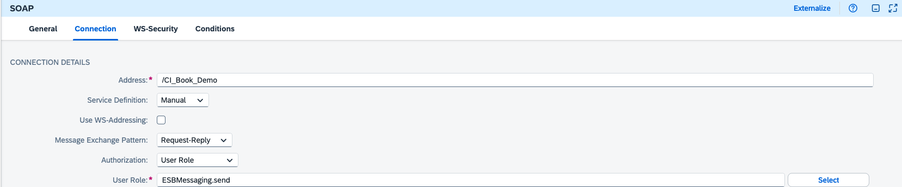
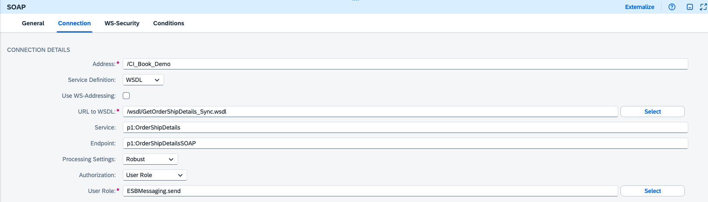

# SOAP Adapter

According to Wikipedia's definition, SOAP is a messaging protocol specification for exchanging structured information in the implementation of web services in computer networks. Its purpose is to provide extensibility, neutrality, verbosity, and independence.
SOAP uses XML as the message format and relies on HTTP as the application layer proto-col.

The SOAP sender adapter is used to enable Cloud Integration to accept an incoming
SOAP message and process it. Similarly, a receiver SOAP adapter can be used to send a
SOAP message to another system.

When you're exposing an iFlow in Cloud Integration with a SOAP endpoint, you would often have a Web Services Definition Language (WSDL) file or URL, which will define the structure of the request and response messages along with some additional infor-mation. You can find a detailed explanation of the [components of a WSDL](www.w3.org/TR/wsdl20/).

### References
- [W3 SOAP](http://www.w3.org/TR/soap/)