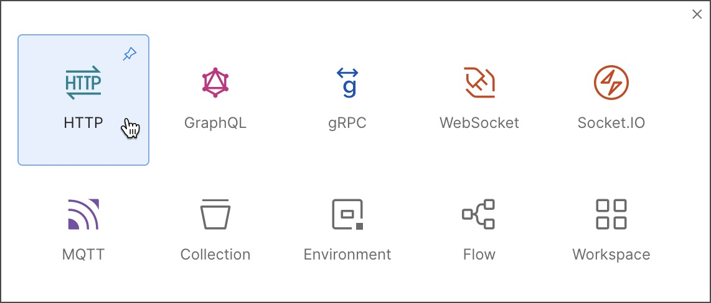
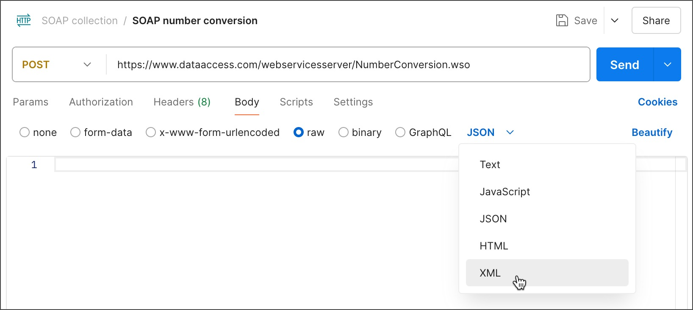
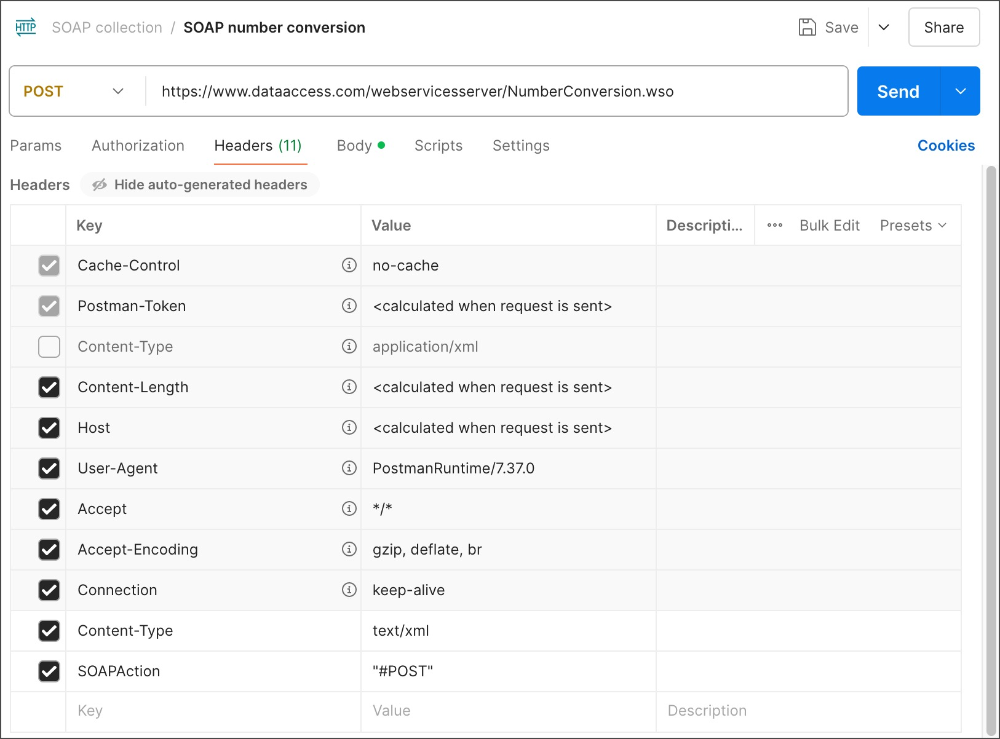

# Make HTTP calls using the SOAP protocol

Postman can make HTTP calls using Simple Object Access Protocol (SOAP), a platform-independent messaging protocol specification.

1. To open an HTTP request, select New > HTTP.



2. Enter your SOAP endpoint URL in the address field. For this example, use the following endpoint URL (e.g.: Integration Suite )
3. Select POST from the request method dropdown list.
4. In the Body tab, select raw and choose XML from the dropdown list.


5. Enter your XML in the text entry area. To test the number conversion SOAP API used in the previous section, enter the following XML in the text entry area:

```
<?xml version="1.0" encoding="utf-8"?>
<soap:Envelope xmlns:soap="http://schemas.xmlsoap.org/soap/envelope/">
  <soap:Body>
   <NumberToWords xmlns="http://www.dataaccess.com/webservicesserver/">
     <ubiNum>500</ubiNum>
   </NumberToWords>
  </soap:Body>
</soap:Envelope>

```
6. Setting request header

When you select an XML body type, Postman automatically adds a content type header of application/xml. But depending on your service provider, you may need text/xml for some SOAP requests. Check with your SOAP service to decide which header is appropriate. If you need the text/xml header, override the default setting added by Postman.

```
Open the request Headers. If the auto-generated headers are hidden, select hidden to display them.

Clear the Content-Type header, which was automatically added.

Add a new key-value pair, Content-Type and text/xml.

Add another key-value pair, SOAPAction and "#MethodName"(in this example, "#POST").
```



7. Send request 