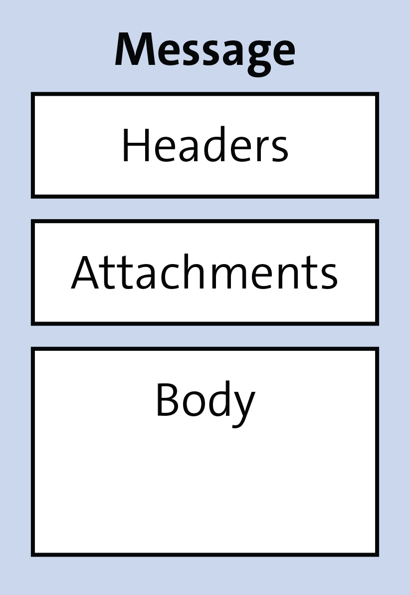
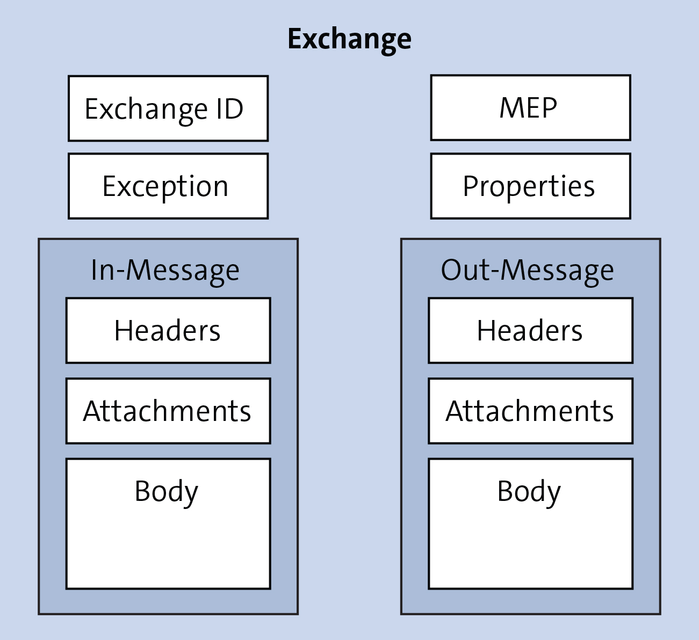

# Apache Camel 

* CPI supports Apache Camel 3.*

## Apache Camel Message Model
So, what exactly is Apache Camel? A message routing and mediation engine, Apache Camel is payload agnostic, which means you can feed the engine any data, in any for-mat, and Apache Camel will forward the data to the right receivers depending on the modeled route.

As long as you don't need to access the message's content (e.g., for routing or transformation), Apache Camel can handle any message format. However, messages must follow a basic structure to be usable by Apache Camel.

Apache Camel messages consist of headers, a body containing the raw data (the pay-load), and (optional) attachments. Messages are uniquely identified by an identifier of the type **java.lang.String**.

Headers contain additional values associated with the message:
- the sender identifier
- hints about content encoding
- authentication information

This information is included in the form of name-value pairs and is stored in the message as a map.

The **header** name is a unique, case-insensitive string, whereas the value is of the type **java.lang.Object**. Almost anything can be added as an object to the header.

The same is applicable for the **body**, which is also of the type **java.lang.Object**.

**Attachments** are typically used for web services and email components and can transport additional data as separate items, if necessary.

During message processing, Apache Camel requires a dedicated container for the mes-sage. This container, called an **exchange**, holds additional data besides the message. The **exchange** is passed along, step by step, in the processor chain, and every step has access to all the information the **exchange** carries. Consider an **exchange** as a kind of global storage for the message's route while the message is being processed.

- **Exchange ID**: A unique ID that identifies the exchange.
- **MEP**: This field refers to the message exchange pattern (MEP), which is used to differentiate between request-response and one-way messaging between the systems. It can contain one of two possible values: **InOnly** and **InOut**.
    - **InOnly** The route handles a one-way message where the sender doesn't wait for a reply from the receiver. Thus, the exchange carries an in message only. A scenario where a message travels in one direction only and where no response message is expected during the communication is also known as asynchronous message handling.

    - **InOut** The route handles a request-response message. The sender expects a reply from the route, which will be stored as an out-message in the exchange. This behavior is also known as synchronous message handling. 

- **Exception** If an error occurs during message processing, the reason for the error is stored in the **Exception** field of the exchange.

- **Properties** A form of temporary storage where process steps can store data in addition to the header area in the message. Properties can contain global-level information. Developers can store and retrieve properties at any point during the lifetime of an exchange.

----
*Difference between Headers and Properties*

*Note that headers are part of a message and are propagated or transferred to a receiver. On the other side, properties last for the entire duration of an exchange but aren't transferred to a receiver.*

----

### References
* [Apache Camel](http://s-prs.co/v576006)