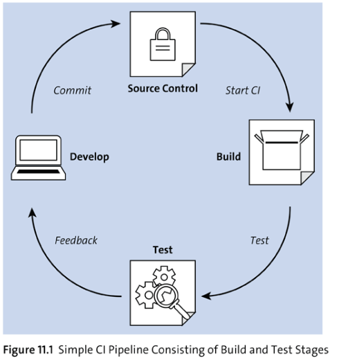

# SAP DevOps


## Content

| Topic                             | Description           |
|-----------------------------------|-----------------------|
| [Git](#Git)                       | Git / GitHub / GitLab |
| [Extensions](#Extensions)         | Extensions for SAP    |
| [Install](#Install)               | Install               |
| [Connect to SAP](#Connect_to_SAP) | Connect to SAP        |
| [BAS](#BAS)                       | SAP BAS               |
| [CI/CD](#CI/CD)                   | CI/CD                 |
| [References](#References)         | References            |


-----
### Git

[<- Back to TOP](#Content)


## Using Git

```
    % git --version
    // necessary when more people are workiing on a project
    % git config --global user.name "<name>"
    % git config --global user.email "<email>"
```

-----

## Process of Git

1. Creating a Repository (first step in any new project)
```
% mkdir <project folder/subfolder(if needed)>
% git init
```

```
<!DOCTYPE html>
<html>
    <head>
        <title>My Web Page</title>
    </head>    
</html>
```
2. gitignore -> Autogenerated files, Dependencies, Credentials
3. Branches

---------
### Git 


GitHub actions makes it easy to automate all your software workflows, now with world-class CI/CD. Build, test  and deploy your code right from GitHub.
Make code reviews, branch management, and issue trianging work the way you want.
Currentlly:
```
npm run deploy  
```

In case we’re using CI/CD on an ABAP system for UI5 apps, we could have CI/CD/CD. Let me explain this:

CI: Commit and push changes of your UI5 app to the master branch on git from in the SAP Web IDE. This will trigger the build and unit test automatically.
Continuous deployment: We could create a grunt task to deploy the UI5 app automatically to the ABAP system. (not completely CD because it’s only deploying the app to the development system)
Continuous delivery: The automatic deploy will only deploy the app to the DEV system. For getting the app in production, you need to use the transport management in the ABAP system. This system requires you to import it to production with a button click.

Content:
1. Git Basics
2. Transfering Chages from the remote repo
3. Working with new branches
4. Adopting chnages from a Branch
5. File Different States in Git

----


## Git Basics (linux, MAC and Win have instalation files)
1. Install Git
``` 
$ sudo yum install git
// or
$ sudo apt-get install git
```
2. Check version by
``` 
$ git --version
```
3. Configure username and email
```
    $ git config --global user.name "John Doe"
    $ git config --global user.email "john.doe@email.com"
```
4. Create new Git repository (for every project, there are 2 ways to do it)
   1. clone repo
    ```
    $ git clone <url to repo on GitHub/GitLab/...>
    ```
   2. initialize local repo
    ```
    $ mkdir example-project
    $ cd example-project
    $ git init // after this, empty repo is initialized (.git directory is created)
    ```
5. Do some work ...
6. Add files to staging area
``` 
$ git add .
```
7. Commit changes to local repo
``` 
$ git commit -m "Initial commit"
```
8. (Optional) Check status of the Git
```
$ git status
```
9. Transfer changes to remote repository (not necessary for git clone initialization of local repo)
```
$ git remote add origin  < repo url >
```
10. Push changes from local repo to remote repo
```
$ git push
// or 
$ git push origin master
```

---
## Transfering Chages from the remote repo

If you work on a team, it’s usually the case that before you push your own changes (or commits) to the remote repository, you transfer the changes of other developers from the remote repository to your own computer or to the local repository. This is done using the ``` git fetch ``` command, which is assigned the name of the remote repository as a parameter.
```
$ git fetch origin 
``` 

This means that all commits from the remote repository that aren’t yet in the local repository are transferred there, to so-called remote branches, which are development branches that exist in parallel to the main development branch (usually the master branch). In this way, you have the opportunity to review appropriate changes before you subsequently incorporate them into your own master branch. The latter in turn is done via the ``` git merge ``` command, which is passed the name of the remote branch as a parameter.

```
$ git mere origin/master
```

Here it can happen that changes of other developers cause conflicts with your own changes. These conflicts can then be solved manually via the command line or the editor or development environment used in each case.

If we want to do both commands at once, we use:
```
$ git pull
```

---
## Working with new branches

An essential part of working with Git is the branches feature mentioned previously. These are development branches that allow you to develop new features or perform bug fixing independently of the main development branch. By default, you work on the master branch (which is created by the git init command by default).

The ``` git branch ``` can be used to list all branches of a repository

Create new branch:
```
$ git branch < name of new branch >
```

Branches are an important component of the development process in Git. If, for example, you want to <b>add a new feature</b> or <b>fix a bug</b>, you usually create a new branch to encapsulate the associated changes from the source code of the main development branch. In this way, you can make sure that unstable code is not transferred directly to the main development branch.

To switch branches you can use ``` git checkout <branch> ``` . Activa branch is marked by ``` * ``` symbol .

---
## Adopting chnages from a Branch

Once you’re done with a new feature or fixing a bug in the corresponding branch and want to merge the associated changes into the main development branch, you must first switch to the branch you want to merge the changes into and then use the ``` git merge ``` command.

```
$ git checkout master
$ git merge < branch with new feature/bug-fix>
```


---
## File Different States in Git

You can check state fo the files by:
```
$ git status
```

| State        | Description   |
| ------------- | ------------- | 
| untracked (or unversioned) | file isn't yet even considered by version control|
| modified (or edited) | file has been modified since last commit|
| unmodified | file hasn't been modified since last commit |
| staged | file is scheduled for the next commit |

----

### Connecting an Existing Projecct to Git (BAS/VSCode)

1. In the Project Explorer, select you project.
2. Click "git" from the left side-menu to open the Git view.
3. Click "+" sign/button to initialize the local repository.
4. Click "+" in the CHANGES section to add the files in your new local repository. This stages them for the first commit.
5. Click  (or press <Ctrl> + <Enter> ) to commit the files that you've staged in your local repository.
6. When prompted, provide a commit message. Your project is now connected to your local Git repository.

## Adding a Project to Git Remote
1. Click  "git" from the left side-menu to open the Git view.
2. Click "..." to see more available actions.
3. Select <b>Remote</b>><b>Add Remote</b>
4. When prompted, add the URL for the remote repository where your local repository will be pushed.
5. Push the changes in your local repository to the remote Git repository.

Prerequisites:
- [Connect to Your Git Source Control System](https://help.sap.com/docs/SAP%20Business%20Application%20Studio/9d1db9835307451daa8c930fbd9ab264/e7a42bcb9d124b43be7e396b11d5e808.html)


### Git Commands

Content:

1. Install Git - Linux
2. Config Git
3. Creating repository
4. Local Changes
5. Commit History
6. Branches and Tags
7. Updating and publishing
8. Merging and Rebasing
9. Undo
10. Terminology

---

## 1. Install git

| Command        | Description   |
| ------------- |:-------------:| 
| sudo yum install git     | Install Git on Linux machine with Yum |
| sudo apt-get install git| Install Git on Linux machine with apt-get | 

---

## 2. Config git

| Command        | Description   |
| ------------- |:-------------:| 
| git config --global user.name "John Doe"    | Set git config user name |
| git config --global user.email "john.doe@email.com"    | Set git config user email |


---

## 3. Creating repository

| Command        | Description   |
| ------------- |:-------------:| 
| git init| local git init|
| git clone < repo url >   | clone git from server |


---

## 4. Local Changes
| Command        | Description   |
| ------------- |:-------------:| 
| git status | 	Outputs status information |
| git diff	| Displays changes to the versioned files |
| git add .	| Adds all local changes to the next commit |
| git add -p FILE | Adds the changes to a file to the next commit|
| git commit -a | Commits all tracked changes |
| git commit -m "Update" | Commits the changes from the staging area |
| git commit --amend | Modifies the last commit (note: do not modify commits <br/> that have already been uploaded to a remote repository |

---

## 5. Commit History
| Command        | Description   |
| ------------- |:-------------:| 
| git log	| Outputs all commits, starting with the last commit |
| git log -p < file > | Outputs all commits for a file, starting with the last commit |
| git blame < file >	| Outputs who has made what changes to a file and when |
| git stash	| Transfers the local changes from the workspace to the clipboard |
| git stash pop	| Transfers the local changes from the clipboard to the workspac |


--- 

## 6. Branches and Tags
| Command        | Description   |
| ------------- |:-------------:| 
| git branch -av | Lists all branches |
| git checkout < branch > | Switches to the existing branch |
| git branch < branch > | Creates a new local branch |
| git checkout --track < remote >/< branch > | Creates a new local branch based on a remote branch |
| git branch -d < branch > | Deletes a local branch| 
| git tag < tagname > | Adds a tag to the current commit |


---

## 7. Updating and Publishing
| Command        | Description   |
| ------------- |:-------------:| 
| git remote -v	| Lists all remote repositories |
| git remote show < remote > | Displays information about a specific remote repository |
| git remote add < shortname > < url > | Adds a new remote repositor |
| git fetch < remote > | Downloads all changes from the remote repository, <br/> but no integration in HEAD (i.e., the current branch). |
| git pull < remote > < branch > |	Downloads all changes from the remote repository  and <br/> integrates or merges them directly into HEAD |
| git push < remote > < branch > | Uploads the local changes to the remote repository |
| git branch -dr < remote >/< branch> | Deletes a branch in the remote repository |
| git push --tags |	Uploads the tags to the remote repositor |


--- 
## 8. Merging and Rebasing
| Command        | Description   |
| ------------- |:-------------:| 
| git merge < branch > | Merges the changes from a branch into the current HEAD |
| git rebase < branch >	| Rebases the current HEAD to the specified branch | 

---
## 9. Undo
| Command        | Description   |
| ------------- |:-------------:| 
| git reset --hard HEAD |	Discards all local changes in the workspace |
| git checkout HEAD < file> | 	Discards local changes to a single file in the workspace |
| git revert < commit >	| Reverts a commit |
| git reset --hard < commit > | Resets the HEAD to a previous commit </br> and discards any local changes that have occurred since then |
| git reset < commit > | Resets the HEAD to a previous commit </br>and keeps all local changes that have taken place since then |
| git reset --keep < commit > | Resets the HEAD to a previous commit </br> and keeps any local changes that have occurred </br> since then and have not yet been committe |


---

## 10. Terminology
| Concept        | Description   |
| ------------- |:-------------:| 
| Repository	| Contains all files of a (software) project including previous versions |
| Remote repository | Remote repository |
| Working directory	| Workspace |
| Index/staging area | Area where changes are prepared for committing to the local repository |
| Commit | Transfer of changes from the staging area to the local repositor |
| Push | Transfer of changes transferred to the local repository to the remote repository |
| Pull | Transfer of changes from the remote repository to the local repository |
| Checkout | Retrieval of a working copy from a branch or a commit |
| Clone	| Copying of a remote repository | 
| Branch | A separate development branch |
| Merge	| The combining of changes from one branch to another branch |
| Fork	| Offshoot of a repository| 
| HEAD | Current branc |


[<- Back to TOP](#Content)

-----

### Extensions

[<- Back to TOP](#Content)

| Name                             | Description                                                                                          |
|----------------------------------|------------------------------------------------------------------------------------------------------|
| SAP Fiori tools - Extension Pack | Application Wizard, Application Modeller, Service Modeller, XML tools                                |
| Auto Rename Tag                  | Update paired HTML & XML tags                                                                        |
| ESLint                           | Static code checks on JS [Example](https://gist.github.com/Leoooob/fecd43da2662288cf9c1c35a60573178) | 
| GitLens                          | Git Integration                                                                                      |
| Prettier                         |                                                                                                      |
| Better Comments                  |                                                                                                      |
| VS LiveShare Extension Pack      |                                                                                                      |
| Better Comments                  ||
| VS LiveShare Extension Pack      | Not in BAS                                                                                           |


## Extensions for ABAP

| ABAP Extension          | Description                           |
|-------------------------|---------------------------------------|
| ABAP remote filesystem  |                                       |
| ABAP Syntax Highlightin | Included in ABAP Remote               |
| ABAP CDS Support        | INcluded in ABAP Remote               |
| abaplint                | Not fully compatible with ABAP Remote |
| ABAP Snippets           |                                       |


[<- Back to TOP](#Content)


-----

### Install

[<- Back to TOP](#Content)

- Download VSCode from Web
- Intall Node.JS (best is  NVM)
-
```
    // from the NVM webSite
    
    //open the file ~/.zshrc
    code ~/.zsh
    
    // insert
    export NVM_DIR="$HOME/.nvm"
    [-s "$NVM_DIR/nvm.sh"] && . "$NVM_DIR/nvm.sh"
    
    // save and run 
    source ~/.zsh 
```


```
% nvm list
% nvm install --lts
% nvm use --lts

```


[<- Back to TOP](#Content)

-----

### Connect_to_SAP

[<- Back to TOP](#Content)

## Required extensions
* ABAP Remote filesystem
* ABAP Syntax Highlighting (included with ABAP Remote filesystem)
* ABAP CDS Support (included with ABAP Remote filesystem)
* abaplint
* ABAP Snippets

---

## Process
- You can read objects from the server on almost any setup
- To write objects, you'll need to either update your system to SAP BTP, ABAP environment v7.51+, or install the plugin from [web](http://s-prs.co/V560653)
- Enable ADT by ```SICF``` service name ```adt_srv``` under OData tree

---

### On-Premise Configuration
- ```Run: Command Palette``` and ```Abap Fs: Create connection``` 
- Run: Fiori: Add SAP System 
-  

---

### BTP ABAP Environment
- Once you have created a trial account, download the ```Service Key```
- ```Run: AbapFs Create Connection```
- Select the system option ```Cloud instance - load service key from file```
- ```Run: Command Palette``` and run ```AbapFs Connect to an ABAP System```
- 


[<- Back to TOP](#Content)

-----

## BAS

[<- Back to TOP](#Content)

|Obsah|
|---|
|[Full Stack Dev](./sub/sap_bas_full_stack.mdris)|


### Deploy SAP Fiori App to ABAP System

### Prerequisite
- activate in transaction
```
/iwfnd/maint_service
```
service

```
$ npm install
$ npm run build
$ abap-deploy 
```

### Configuration in GitHub
1. Log in to your GitHub account, click on the <b>Settings</b> icon, and then choose <b>Settings</b> in the dropdown menu, which will bring you to the page shown in following image:

   

2. Click on the <b>Emails</b> tab, and then copy the email address in the highlighted box because you'll use this for future reference to set up the GitHub configuration in SAP BAS. To learn more aout the GitHub-based email ID tio use while checking in and checking out, refer to the link <b>set your email in Git</b> near the bottom of the screen.

3. Next, you set up the password that you'll use while pushing the code changes to GitHub or pulling the changes from GitHub. SAP Business Application Studio uses a password token to fetch or push any changes to the GitHub branch. To set up the password token, once again navigate to the settings, and click on the <b>Developer settings</b> tab.

4. In the new view that opens, click on <b>Personal access tokens</b>.

5. Click on <b>Generate new token</b>, and on the <b>New personal access token</b> page, provide the name of the token in the Note field. Click on the checkboxes that you plan to allow while setting up the token password, and define the expiration time as highlighted. <b>Token expiration</b> should be between 30 to 90 days.

6. After you've chosen the expiration duration and operation allowed using this password access token, navigate to the bottom of the page, and click on <b>Generate token</b>.

7. After successfully generating the token, you need to <b>copy the token</b> because it won't be available to view later. Save it somewhere safe, as you'll use this token later in the steps to push the code changes to the GitHub repository.

## Configuration in SAP BAS

1. Launch SAP Business Application Studio with respective workspace.

2. Select <b>Terminal -> New Terminal</b> from the top menu.

3. In the new terminal,  execute the following commands to
   set up the Git configuration:

```
$ cd projetcs
$ git config --global user.email <email from GitHub>
$ git config --global user.name "<name>"
$ git config --list
```

Example for CEZ GitLab
```
$ cd projetcs
$ git config --global user.email <KPJM>
$ git config --global user.name "<firstname surname>"
$ git config --list

```

Example in general:
```
$ git config --list
$ git config --global user.email <email from GitHub>
$ git config --global user.name "<git hub user name>"


```

4. Now you need to set up the project, check out of the GitHub repository, make a sample change and push those changes to the Git Hub repository, and then check if changes are pushed successfully or not. A sample GitHub repository with a change made to test.txt file.

5. Execute the following steps in sequence to check out the GitHub repository <b>testrepo</b> and navigate to the <b>testrepo</b> repository through the terminal:


```
$ cd projects
$ mkdir myworkspace
$ cd myworkspace
$ git init
$ git clone <https://github.com/<githubaccount>/testrepo.git>
$ cd testrepo
```

6. To open the checked-out project, click on Open Folder. Navigate to the TESTREPO project, and click on test.txt.

7. Add a few statements, and execute the following commands one by one to commit the changes back to GitHub.

```
$ git add .
$ git commit -m "adding the changes"
$ git push
```

8. Enter <b>username</b> and <b>password token</b>.

### Note
Note that the user email is generated by GitHub, so if you set it here as the primary email ID, which you also used to create the CitHub account, then you need to unselect the Keep my email address private option. If not, you'll get the error GH007 Your push would publish a private email address.

## How to Cache Username & Password ( Token ) in SAP BAS

Two options:
1. .netrc in SAP BAS
2. Git Credential helper
------
### Option 1.
To save your Git personal access token in your Dev Space, you just need to create
a .netrc file in $HOME directory & add below syntax.
1. IN BAS click on File Menu > Open Workspace > Select "User" workspace and Click "Open"
   
2. Right click and create new file in ROOT dir USER
   
3. add the following content as per your github.com
```
machine <git_host>
login <user_id>
password <token>
```


### Git Bash Commands

https://git-scm.com/docs/git

### Manage Authorizations

To ensure that you have the proper authorizations for SAP Business Application Studio, follow these steps:

1. Log in to your SAP BTP account.
2. Navigate to your subaccount.
3. In the left panel, click on the Security • Role Collections.
4. To access the SAP Business Application studio, you need the three roles shown in table

| Role                                      | Description | User role |
|-------------------------------------------| ----------- |------------|
| Business_Application_Studio_Administrator | Allow users to manage the user’s data, such as admin settings, export, delete and apply changes.  | Admin |
| Business_Application_Studio_Developer     | Allows users to load and develop applications, and add extensions from the Open VSX Registry using SAP Business Application Studio. | Developer |
| Business_Application_Studio_Extension_Deployer |  Allow extension developers to deploy and run simple extensions | Extension Deployer |


More about role collections: [Here](http://s-prs.co/v548500)

[<- Back to TOP](#Content)

-----

## CI/CD

[<- Back to TOP](#Content)

### UI5 tooling

<b>Prerequisites</b>

1. Install Node.JS
2. Install VSCode
3. Install UI5 CLI
``` 
npm install --global @ui5/cli
// aditional local install in your project
npm install --save-dev @ui5/cli
npm init
ui5 init
ui5 use sapui5@latest
ui5 add sap.ui.core sap.m sap.ui.table themelib_sap_fiori_3
npm run start   // or ui5 serve -o index.html
```
4. Create UI5 Application
5. Deploy to ABAP Server

### Automate UI5 Deployment


```
// if ui5-deploy.yaml is in project then
npm run build
npm run deploy

// if not then
npx fiori add deploy-config
npm run build
npm run deploy
```


```
npm install @ui5/cli
npm install @sap/ux-ui5-tooling

```
### Content of ui5-deploy.yaml

```
builder:
  customTasks:
  - name: deploy-to-abap
    afterTask: replaceVersion
    configuration:
      target:
        url: https://XYZ.sap-system.corp:44311
        client: 200
        auth: basic
      credentials:
        username: env:XYZ_USER
        password: env:XYZ_PASSWORD
      app:
        name: /TEST/SAMPLE_APP
        package: /TEST/UPLOAD
        transport: XYZQ300582
      exclude:
      - .*\.test.js
      - internal.md
```

NodeJS Template on GitHub Action

1. install nodejs
2. install ui5 tooling
3. npm install @sapui5/cli
4. npm run deploy
5.


- user.email=ohriskamar
- user.name=Martin Ohriska

### CI 4 S/4HANA

# CI for S/4HANA

- Ability to ship or deploy bug-free and regression-free software fast is a competitive advantage for any company.
- SAPUI5 -> GitHub/Lab, ESLint, Grunt, Jenkins, Docker & Node.js to build the stages and steps of our CI/CD pipelines
- ABAP -> CTS (CDS, ABAP,...) ATC (ABAP Test Cockpit), ABAP Unit Runner

## Continuous Integration
- CI is one of 12 original practices of the Extreme Programming (XP)
- SCM (like Git) is the one and only source of truth for the software
- fosters runnable and presentable software




## Continuous Delivery
- CD takes CI a step further
- ship the software to system
- should decided dev team or delivery manager
- Delivery requires that the software be built, tested, and available in an immediately shippable or deployable format as the output of the CI process


## Continuous Deployment
- CDeployment takes CD a step further and eliminates any manual steps and decisions taken before the software artifact is shipped or deployed to production
- as soon as sofware is built and tested successfully, your software can be automatically shipped to your customers or deployed to production without any further human interaction
- Continuous Deployment requires the automation of every single step of the deployment pipeline and a comprehensive automated test suite that covers all aspects of the software (unit, integration, system, performance, security)


### CI 4 ABAP Server


# Setting Up a Continuous Integration Pipeline for SAPUI5 on the ABAP Server

## Prerequisites
1. SAP Web IDE/BAS
2. GitHub (GitLab)
3. SAP system
4. Jenkins for CI pipelines (triggered on each push), Docker
1. build (new deployment ready version, minify/ESLint),
2. test (QUnit and OPA5 tests),
3. deploy (store software as ZIP  in JFrog Artifactory, deploy through RFC),
5. to automata different stages, we will use Grunt JavaScript task runner because SAP provides best practice Grunt plug-ins for the build and test stages


## Setting Up the environment
1. Local Jenkins
1. Look for docker image: jenkinsci/blueocean/
2. docker run for windows
  ```
  docker run -u root -d -p 8080:8080 -v jenkins-data:/var/jenkins_home -v /var/run/Docker.sock:/var/run/Docker.sock --name jenkins jenkinsci/blueocean
  ```
3. access jenkins on ``` http://localhost:8080```
4. Jenkins password needed to unlock Jenkins is writen in log and access it via ``` docker logs jenkins ```
5. follow wizard to finish installation (accept suggestions and create admin user)
6. create an initial Jenkinsfile
   - Jenkinsfile must reside in the root folder of the project (next to webapp folder)
   - sample Jenkinsfile

    ```
    pipeline { 
    
      agent any
      // or agent { docker { image 'node:8.11.3'} }
    
    stages {
        
        stage('build'){
          sh 'npm config set @sap:registry  https://npm.sap.com'
          sh 'npm install'
          sh 'npm run-script build'
        }
        
        stage('test'){
          sh 'npm run-script test'
        }
        
        stage('deploy'){
          // Package the dist folder as a zip file
          sh "cd dist && zip -r ../${BUILD_ZIP_FILE_NAME} * && cd .. 
          // Upload the zip file to Frog Artifactory
          script {
            def server = Artifactory.server 'ART'
            def uploadSpec = """{
              "files":[
                {
                  "pattern": "${BUILD_ZIP_FILE_NAME}",
                  "target": "UI5/"
                }
              ]
            }"""
            def uploadBuildInfo = server.upload(uploadSpec)
            server.publishBuildIinfo uploadBuildInfo
          }
        }
        
      }
      
    }
    
    ```

7. Create a CD Pipeline in Jenkins. Go to <b>Pipelines>Create New Pipeline</b>
8. Create token in GitHub/GitLab for Jenkins
9. Select where to store your SAPUI5 project code (e.g.: GitHub/GitLab, via token)
10. Select the repository for which you want to create the pipeline and click on <b>Create Pipeline</b>
11. SAP Web IDE generate also Grunt File (Gruntfile.js)... check it out, and package.json... Grunt is development dependency
12.   SAP currently provides two best practice Grunt plug-ins for building and testing an SAPUI5 project on https://npm.sap.com
   ```
   @sap/grunt-sapui5-bestpractice-build // add as devDependencies
   @sap/grunt-sapui5-bestpractice-test
   
   npm config set @sap:registry https://npm.sap.com
   ```
13. every ``` npm install ``` with scope @sap will request packages from the associated registry
14. optional - for OpenUI5 apps look for UI5 tooling at ``` https://sap.github.io/ui5-tooling/ ```
15. load the plug-in inside the Gruntfile.js and then register a new buildProject task and add a task list to it containing the clean, lint and build tasks
  ```
  module.exports = function (grunt) {
    "use strict";
    grunt.loadNpmTasks("@sap/grunt-sapui5-bestpractice-build");
    grunt.registerTask("buildProject",[
    "clean",
    "lint",
    "build"
    ]);
  };
  ```
16. adapt package.json
  ```
  "scripts":{
    "build": "grunt buildProject --verbose"
  }
  ```
17. Automatically triggering builds on Git Push through GitHub hooks (GitLab alterantive CI/CD)
18. Immplement the test stage


19. Implement the deploy stage

20. SAP provides ABAP FM ``` /UI5/REPO_LOAD_FROM_ZIP_URL```, which is RFC enabled and can be called by CI/CD script. Old one is ``` /UI5/UI5_REPOSITORY_LOAD_HTTP ```

21. To call SAP RFC-enabled FM from Grunt tasks, you can use the SAP RFC connector for Node.js ``` https://github.com/SAP/node-rfc ```. As a prerequisite, you must install the SAP NetWeaver RFC SDK and make it available in the runtinme environment of your CI/CD pipeline, in our case, the Docker container.

22. add custom grunt task ``` deployProjectToGateway ``` to our Gruntfile.js and inside the task you can call ``` /UI5/UI5_REPOSITORY_LOAD_HTTP ``` passing URLto latest version of sapui5 project in jFrog.
  ```
  grunt.registerTask("deployProjectToGateway", function(){
    ...
  });
  ```
Like the previous <i><b>build</b></i> and <i><b>test</b></i> stages, you could add a <i><b>script</b></i> entry for the Grunt deplou task ``` "deploy": "grunt deployProject --verbose" ``` to package.json file and call the script from <i><b>deploy</b></i> stage inside the <b>Jenkinsfile</b>.

23. Note: if you need to transport the SAPUI5 project in your development landscape, e.g.: from dev to quality assurance system, you can additionally use the RFC-enabled ``` BAPI_CTREQUEST_CREATE ``` & ``` BAPI_CTREQUEST_RELEASE ```


### CI References
- [Working with Integration Suite Piper commands and Microsoft Azure DevOps](https://community.sap.com/t5/technology-blogs-by-members/working-with-integration-suite-piper-commands-and-microsoft-azure-devops/ba-p/13530658)
- [Demystifying DevOps with SAP BTP: Part 1 – What is DevOps?](https://blogs.sap.com/2023/09/11/demystifying-devops-with-sap-btp-part-1-what-is-devops/)

- [Continuous Integration in UI5 Projects](https://www.youtube.com/watch?v=bmEz-g34H-g)
- [openui5](https://github.com/SAP/openui5)
- [Automating UI5 app deployments using GitHub Actions](https://blogs.sap.com/2022/03/04/automating-ui5-app-deployments-using-github-actions/)
- [Deploy a Static Web Page – Cloud Foundry Basics #1](https://www.youtube.com/watch?v=ZfxKnOZSnKk&list=PL6RpkC85SLQC3HBShmlMaPu_nL--4f20z)
- [A to Z - How to Deploy SAP Fiori App to On Premise System from SAP Business Application Studio BAS](https://www.youtube.com/watch?v=zSdgBDimnWI)
- [SAPUI5 Essential-Deploy to ABAP Server form VS code](https://www.youtube.com/watch?v=ft76Vv65Eg8)
- [CI/CD for Fiori App | Automate Fiori App deployment to ABAP system | git actions FREE | SIMPLE](https://www.youtube.com/watch?v=lIyATDhH1_w)
- [Building an App with SAP Fiori tools: Deploying your application](https://www.youtube.com/watch?v=I7i9kIiK2ZY)
- [GitLab Flow | GitLab Tutorial | Part I](https://www.youtube.com/watch?v=ZJuUz5jWb44)
- [Deploy Serverless SAP Fiori Apps from the Kyma Runtime](https://www.youtube.com/watch?v=48vOeu7XqkM)
- [Marius Obert - Serverless SAP Fiori Apps in SAP Cloud Platform](https://www.youtube.com/watch?v=ZbD3DuuqU2A)
- [Deploy SAP Fiori Worklist Template to Heroku cloud](https://www.youtube.com/watch?v=DRRKz_u5KXU)
- [Deploy SAP Fiori Master-Detail Mockdata Internal to Heroku cloud](https://www.youtube.com/watch?v=RhbJ7bhMXRE)
- [Develop an SAP Fiori Freestyle Application for SAP S/4HANA with SAP Business Application Studio](https://www.youtube.com/watch?v=PFBoqhAJmP4)
- [SAP Fiori mit Visual Studio Code - Migration eines WebIDE Projekts](https://www.youtube.com/watch?v=CEsRUES9_zU)
- [Deploying SAPUI5 Application to SAP® Cloud Using BAS | Development With SAP® BAS](https://www.youtube.com/watch?v=1cMzNP487OY)
- [Consume UI5 web apps from the html application repository - Marius Obert](https://www.youtube.com/watch?v=emnl-y9btdU)
- [SAP Business Application Studio for SAP Fiori Development - Exercise 2](https://www.youtube.com/watch?v=p1f0Albi7eE)
- [SAPUI5: Build, Deployment (#6)](https://www.youtube.com/watch?v=ReZOHY8S2h0)
- [SAP webIDE with git | Fiori training on WebIDE and XML | UI5 tutorial](https://www.youtube.com/watch?v=dxcNcSputaE)
- [Demo - SAP Business Application Studio: Guided Development for SAP-Fiori Elements](https://www.youtube.com/watch?v=HUTQIhOu98A)
- [SAP Business Application Studio for SAP Fiori Development - Introduction and Exercise 1](https://www.youtube.com/watch?v=VFLFp_pHYJQ)
- [Ep.46 - The SAP Business Application Studio with Marius Obert](https://www.youtube.com/watch?v=wG4iVredIwc)
- [SAP UI5 Development Using VS Code by Sagar Patil](https://www.youtube.com/watch?v=zlKbvOK5BNw)
- [Part 5: SAP Cloud Platform Connectivity (Node.js application + Destination + Connectivity Service)](https://www.youtube.com/watch?v=bJitwHPVZfQ)
- [#SAPBTP Development with GitHub Copilot](https://www.youtube.com/watch?v=oimXXKfJWOk)
- [Web IDE - SAP® Web IDE End-to-End | Create UI5 App and Deploy App in Fiori® LaunchPad](https://www.youtube.com/watch?v=podGN9tNnCk)
- [Part 3: SAPUI5 Fiori library (Creating a Fiori Library)](https://www.youtube.com/watch?v=JlDwupW_ESY)
- [SAP HANA Cloud and CAP to Build Full-Stack Applications Using VSCode](https://www.youtube.com/watch?v=yceqr9vycrs&list=PL6RpkC85SLQABOpzhd7WI-hMpy99PxUo0)
- [Setting up CI/CD for SAP Cloud Foundry on GitLab for a SAPUI5 application built with UI5 Tooling](https://blogs.sap.com/2020/03/01/setting-up-ci-cd-for-sap-cloud-foundry-on-gitlab-for-a-sapui5-application-built-with-ui5-tooling/)
- [CI / CD for SAPUI5 on ABAP with GitLab](https://blogs.sap.com/2018/08/01/ci-cd-for-sapui5-on-abap-with-gitlab/)
- [grunt-sapui5-gitlab-deploy](https://gitlab.com/theplenkov-npm/grunt-sapui5-gitlab-deploy)
- [ABAP Development in VS Code](https://blogs.sap.com/2019/12/06/abap-development-in-vs-code/)
- [Run UI5 Applications in VS Code Locally UI5 tooling for node | Ui5 tooling Migrate in your local IDE](https://www.youtube.com/watch?v=LB7wSkFmZ5s)
- [Get started with the new UI5 tooling - Wouter Lemaire](https://www.youtube.com/watch?v=CLAI-bgaUnA&t=8s)
- [UI5 Tooling: The Build and Development Tooling for UI5 | SAP TechEd for SAP Community](https://www.youtube.com/watch?v=gXm46gcOJkw)
- [Apply CI/CD to SAP Fiori Development on an SAP Fiori Front-End Server](https://help.sap.com/docs/CICD_OVERVIEW/3324745951b44b578bd65221d2ff8f9a/3713b07025274c2fbc95467627921a7a.html?locale=en-US)
- [DevOps for ABAP? Try the Git-Enabled Change and Transport System | SAP TechEd in 2020](https://www.youtube.com/watch?v=IU7XJXJGbmE)
- [SAP DevOps Using gCTS, GitHub and Jenkins](https://blogs.sap.com/2021/10/08/sap-devops-using-gcts-github-and-jenkin/)
- [Continuous Integration in UI5 Projects](https://www.youtube.com/watch?v=bmEz-g34H-g)
- [Apply CI/CD to SAP HANA Extended Application Services, Advanced Model Development](https://help.sap.com/docs/CICD_OVERVIEW/3324745951b44b578bd65221d2ff8f9a/55242ddaa08d4f3190fd06171b5f85f5.html?locale=en-US)
- [How to bring your ABAP custom code to SAP BTP ABAP Environment](https://blogs.sap.com/2019/11/11/how-to-bring-your-abap-custom-code-to-sap-cloud-platform-abap-environment/)
- [Practical Guide to Clean Core Custom development for S4 HANA](https://blogs.sap.com/2021/06/04/practical-guide-to-clean-core-custom-development-for-s4-hana/)
- [How to backup custom code with gCTS](https://blogs.sap.com/2021/10/19/how-to-backup-custom-code-with-gcts/)
- [Exploring an Integrated DevOps Workflow in SAP](https://www.youtube.com/watch?v=_DFlwcx5d1U)
- [Create a commit in Git when an ABAP task is released](https://blogs.sap.com/2020/08/05/create-a-commit-in-git-when-an-abap-task-is-released/)
- [Some answers for the gCTS Community Call](https://blogs.sap.com/2020/12/16/some-answers-for-the-gcts-community-call/)
- [How to manage Objects using gCTS in S/4HANA 2020](https://blogs.sap.com/2021/06/15/how-to-manage-objects-using-gcts-in-s-4hana-2020/)
- [gCTS](https://startup.lwmeta.com/?s=gcts)
- [Git-Enabled Change and Transport System](https://help.sap.com/docs/ABAP_PLATFORM_NEW/4a368c163b08418890a406d413933ba7/f319b168e87e42149e25e13c08d002b9.html?version=202009.002&locale=en-US)


[<- Back to TOP](#Content)
-----


### References
- [VSX registry for SAP BAS Extensions](https://open-vsx.org/)
- [UI5 Tooling](https://sap.github.io/ui5-tooling/stable/#development-server)
- [SAP BAS](https://help.sap.com/docs/SAP%20Business%20Application%20Studio/9d1db9835307451daa8c930fbd9ab264/8f46c6e6f86641cc900871c903761fd4.html)
- [Getting Started with SAP Business Application Studio](https://learning.sap.com/learning-journey/modeling-in-sap-hana-cloud/getting-started-with-sap-business-application-studio)
- [Create an SAP Fiori App Using SAP Business Application Studio](https://developers.sap.com/tutorials/appstudio-fioriapps-create.html)
- [SAP BAS](https://help.sap.com/docs/SAP%20Business%20Application%20Studio/9d1db9835307451daa8c930fbd9ab264/0930e56885944a2dbef1bc98ac12b4f0.html)
- [How to setup GIT in SAP Business Application Studio](https://blogs.sap.com/2020/07/07/how-to-setup-git-in-sap-business-application-studio/)
- [Working with Github in SAP Business Application Studio (next generation of SAP Web IDE)](https://blogs.sap.com/2020/10/03/working-with-github-in-sap-business-application-studio-next-generation-of-sap-web-ide/)
- [Cloning Repositories](https://help.sap.com/docs/SAP%20Business%20Application%20Studio/9d1db9835307451daa8c930fbd9ab264/7a68bfa7111b44f6b1e78b51e803238c.html)
- [Working with GIT Within SAP Business Application Studio](https://learning.sap.com/learning-journey/modeling-in-sap-hana-cloud/working-with-git-within-sap-business-application-studio)
- [How to Integrate SAP Development with Standard DevOps Tools](https://blogs.sap.com/2022/03/23/how-to-integrate-sap-development-with-standard-devops-tools/)
- [Efficient DevOps with SAP](https://alexmarket.medium.com/efficient-devops-with-sap-f8e866b528ab)
- [DevOps for ABAP? Try the Git-Enabled Change and Transport System](https://www.youtube.com/watch?v=IU7XJXJGbmE)
- [DevOps for SAP ERP | Boost your productivity & code quality with CI/CD pipelines](https://www.youtube.com/watch?v=RUA87c6EVY4)
- [CI/CD for Fiori App | Automate Fiori App deployment to ABAP system | git actions ](https://www.youtube.com/watch?v=lIyATDhH1_w)
- [Can you do DevOps in SAP?](https://www.youtube.com/watch?v=GSS4RHqUeig)
- [CI/CD for Fiori App | Automate Fiori App deployment to ABAP system | git actions](https://www.youtube.com/watch?v=lIyATDhH1_w)
- [Working with Github in SAP Business Application Studio (next generation of SAP Web IDE)](https://startup.lwmeta.com/2020/10/03/working-with-github-in-sap-business-application-studio-next-generation-of-sap-web-ide/)
- [Git Source Control - SAP](https://help.sap.com/docs/SAP%20Business%20Application%20Studio/9d1db9835307451daa8c930fbd9ab264/9689c07b64364bbea43725dad9f27320.html)
- [How To Connect Your Corporate Github To SAP Business Application Studio](https://blogs.sap.com/2021/02/11/how-to-connect-your-corporate-github-to-sap-business-application-studio/)
- [We’ve Finished Our Renovations: Our New CI/CD Best Practices](https://blogs.sap.com/2020/02/20/weve-finished-our-renovations-our-new-ci-cd-best-practices/)
- [BTP DevOps: Develop Application](https://www.youtube.com/watch?v=FGLNJyEC-ow)
- [Business Application Studio with GitHUB | Working with Github in SAP Business Application Studio](https://www.youtube.com/watch?v=Zs3OFku_S6w)
- [Upload the project into git from SAp Business Application Studio](https://answers.sap.com/questions/13241120/upload-the-project-into-git-from-sap-business-appl.html)
- [Merge Branches into Master Branch in GitHub using Pull Requests](https://developers.sap.com/tutorials/webide-github-merge-pull-request.html)
- [grunt-sapui5-gitlab-deploy](https://gitlab.com/theplenkov-npm/grunt-sapui5-gitlab-deploy)
- [Connect to Your Git Source Control System](https://help.sap.com/docs/SAP%20Business%20Application%20Studio/9d1db9835307451daa8c930fbd9ab264/e7a42bcb9d124b43be7e396b11d5e808.html)

- [SAP BAS on Help SAP ](https://help.sap.com/docs/SAP%20Business%20Application%20Studio/9d1db9835307451daa8c930fbd9ab264/0930e56885944a2dbef1bc98ac12b4f0.html)
- [SAP Learning - Working with GIT Within SAP Business Application Studio](https://learning.sap.com/learning-journey/modeling-in-sap-hana-cloud/working-with-git-within-sap-business-application-studio)

- [Developing an effective CI/CD pipeline for frontend apps](https://blog.logrocket.com/best-practices-ci-cd-pipeline-frontend?mc_cid=10269772c4&mc_eid=aa10fa9f64)
- [How to integrate Azure AD with SAP BTP, Cloud Foundry environment](https://community.sap.com/t5/technology-blogs-by-sap/how-to-integrate-azure-ad-with-sap-btp-cloud-foundry-environment/ba-p/13398216)
* [IN180 - Leveraging Commands from “Piper” for CI/CD Setup with SAP Integration Suite](https://github.com/SAP-archive/teched2022-IN180)