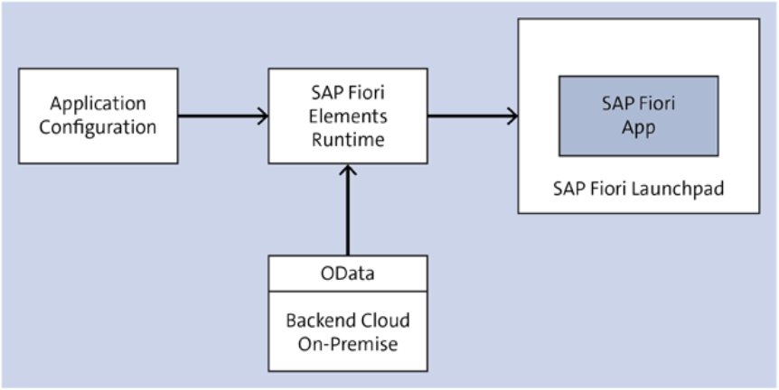

# Fiori Elements (Development & Extensibility)

Rene Glavanovits, Martin Koch, Daniel Krancz, Maximilian Olzinger

* 5 templates (80% of use-cases)


Contents
* how it fits to low-code no-code development
* Dif. between SAPUI5 & Elements
* Application programming models
* two new programming models & Fiori Elements
* 5 floorplans & how to use them
* extensions
* cross app routing
* deployment


SAP STORE
----

Requirements for modern SAP 
 
**Backend**
* OData & APIs
* CDS


**Frontend**
* SAPUI5
* Fiori Elements
* VueJS, ReactJS, AngularJS


- Object locks can cause significant problem in web apps

- Fiori Elements uses Smart Controlls (driven by metadata/annotation)




SAP Fiori Elements is designed to significantly accelerate development while ensuring a consistent UX across apps.

SAP Fiori elements requires you to: 
* Configuration of your app is mandatory in all cases
* The required annotations can be created in the backend or within the app
* your app can also be extended using standard SAP technologies

SAP Fiori Elements supports OData V2 a OData V4

## Low-Code Platforms
- Visual modeling tools
- Prebuilt modules
- Cross-platform support
- Application Lifecycle management
- Reporting and monitoring

### Example application

**Author Entity**
```
ID
Salutation
First Name
Last Name
Date of Birth
email
```

**Book Entity**
```
ID
Author ID
Title
Price
Category
ISBN
Stock
```

