# SAP Fiori Launchpad


## Prerequisites:
- Installation and configuration of SAP S/4HANA
- Activating and configuring SAP Fiori in the on-premise system is a prerequisite for exposing content to the SAP Launchpadservice on SAP BTP

Options for SAP Fiori Launchpad
- Embedded (recommended by SAP)
- Standalone HUB

Following are the tasks you need to perform to activate the SAP Fiori infrastructure:
- Activate SAP S/4HANA embedded analytics
- Activate enterprise search
- Activate SAP Gateway and SAP Fiori
- Activate and configure the SAP Fiori launchpad


## Content


| Topic                                          | Description                                                               |
|------------------------------------------------|---------------------------------------------------------------------------|
| [FLP Options](#FLP_Options)                    | Embeded vs. Central Hub Deployment                                        |
| [FLP Activation](#FLP_Activation)              | Activate and Configure the SAP Fiori Launchpad                            |
| [Catalogs & Groups](#Catalogs_Groups)          | Creating Catalogs and Groups with the SAP Fiori Launchpad Content Manager |
| [S/4HANA FLP](#S/4HANA_FLP)                    | Activate Launchpad on S/4HANA                                             |
| [Spaces & Pages](#Spaces_Pages)                | Launchpad Spaces & Pages                                                  |
| [ERP R3](#ERP_R3)                              | Launchpad on ERP R3                                                       |
| [Federation](#Federation)                      | Requirements and Prerequisite for Federation & Common Data Model          |
| [Exposing Fiori](#Exposing_Fiori)              | Exposing SAP Fiori content from Systems with Frontend Server 2020         |
| [Activating Fiori App](#Activating_Fiori_Apps) | Activatiing a Single SAP Fiori Application                                |
| [FLP Transaction](#FLP_Transactions)           | Launchpad transactions                                                    |
| [Translate FLP](#Translate_FLP)                | Translate FLP Tiles and Groups                                            |
| [SAP Notes](#SAP_Notes)                        | Launchpad SAP Notes                                                       |
| [FLP Theme](#FLP_Theme)                        | Launchpad Themes                                                          |
| [FLP Health Checks](#FLP_Health_Checks)        | Health Checks for Fiori Launchpad                                         |
| [FLP References](#FLP_References)              | Launchpad references                                                      |   


-----

### FLP_Options

[<- Back to TOP](#Content)

Depending on which deployment option you choose, embedded FES or central hub, there are a few things you need to pay attention to when managing SAP Fiori apps. It’s not meant to be a complete list, but it highlights the most important aspects to be aware of.

| Area | Embedded FES | Central Hub FES |
|------|-----|-----|
| Administration |  One launchpad per system to administrate | One single launchpad to administrate in the landscape |
| Central functions | Only local search, notifications, and workflows (My Inbox) | My Inbox, notifications search, and so on |
| Content | Scenarios only covering one system, such as SAP S/4HANA and SAP Customer Activity Repository | Support scenarios across multiple backend systems, providing an on-premise single access point |
| Maintenance | Local maintenance for each system | Central management of patching and upgrade of UI components |
| Roles and authorizations | Maintained in one system, which greatly lower the risk of errors | Decoupled between backend and frontend, which results in higher maintenance and error risk |
| Automated configuration | All steps performed in one system | Tasks need to be executed in different systems depending on steps |
| Rapid activation | Supported | Not supported |


Reading table above, you might get the impression that a central hub is the best choice in the long run, which might be correct in some cases with SAP Business Suite systems and a single SAP S/4HANA system.

However, SAP is stopping maintenance for the SAP Business Suite portfolio in a few years, and the recommendation for SAP S/4HANA is the embedded hub.

So, if you’re planning an SAP S/4HANA implementation greenfield or migration, we strongly recommend using the embedded hub and then using the SAP Launchpad service on SAP BTP to provide a central access point.

[<- Back to TOP](#Content)

-----

### FLP_Activation

[<- Back to TOP](#Content)

### Activate and Configure the SAP Fiori Launchpad

The last task to execute on the list is SAP_FIORI_FOUNDATION_S4, which you once again execute via Transaction STC01, as shown in Figure 5.9. As you can read from the name, this task does the last remaining configuration before your SAP Fiori installation is complete.

Note
As mentioned, this book is based on SAP S/4HANA 2020 FPS02, and, in this chapter, we refer to ```SAP Note 3045635```. In this note, there is a reference to ```SAP Note 2712785```, which contains the latest updates for task ```SAP_FIORI_FOUNDATION_S4```. Remember to implement this before you run the task.

The purpose of the task is to activate OData services and Internet Communication Framework (ICF) nodes needed for generic SAP Fiori launchpad features and SAP GUI for HTML, initiate the technologies needed to run SAP GUI for HTML and Web Dynpro ABAP applications, and generate user and admin roles needed to access and work with the SAP Fiori launchpad.


In addition, pay attention to the last highlighted step in Figure 5.10, Activate and Configure FLP for Spaces and Pages; in this step, you can select to activate spaces and pages and configure the SAP Fiori launchpad to use this concept. In Section 5.2.3, we’ll discuss the concept of spaces and pages in detail.

Execute the task after you’ve modified all the relevant steps. With a successful execution of the tasks, you’ll be able to access the SAP Fiori launchpad via Transaction ```/N/UI2/FLP``` or directly via URL ```http://<server>:<port>/ /sap/bc/ui2/flp``` after you’ve assigned the new role <prefix>_fiori_foundation_user or <prefix>_fiori_foundation_admin to the relevant users.

Admin should see 6 apps:
- Manage Launchpad Apps
- FLP Content Manager: Client-Specific
- Manage Launchpad Spaces
- Manage Launchpad Pages
- SAP Fiori Launchpad Designer (client specific)
- SAP Fiori Launchpad Designer (cross client)

### 5.2. Building an SAP Fiori Role

Identifying which SAP Fiori apps should be activated and rolled out to end users is a major task in an SAP S/4HANA project and shouldn’t be underestimated. One thing to make clear is that SAP Fiori is the go-to user interface (UI) of SAP S/4HANA.


SAP’s recommended way to activate SAP Fiori apps in your SAP S/4HANA system is to identify the business roles that are relevant for your business with the help of the SAP Fiori apps reference library. Here you’ll find information about hundreds of business roles, each containing a number of SAP Fiori apps from a few to more than 100 apps.

In the SAP Fiori apps reference library (https://fioriappslibrary.hana.ondemand.com/), you can filter for “Business Roles,” as shown in Figure 5.12, which will give you more than 500 roles to select from.

After you’ve collected all the business roles from the different lines of business (LoBs), the next step is to activate the roles using the rapid activation task. This is the recommended and quickest way to enable all associated apps, generate roles, and test users per role in just one step.


### 5.2.1. Rapid Activation Task


Let’s look into how the rapid activation task works and what is does. As in the previous section, you use Transaction ```STC01```, but this time, execute task ```SAP_FIORI_CONTENT_ACTIVATION```.


With this task, you can quickly activate multiple business roles and add them to a transport, which can be transported to follow-on systems. In addition, it’s possible to create a test user for use in the fit-gap workshops.


The second step in the task is where you select the relevant business roles. This is done one by one, and when every role is selected, you can execute the task. It’s also possible to mass-select roles, if you select the checkbox for the first step, you can simply copy and paste all the roles from a Microsoft Word.


First, it’s important to verify that the role exists in your system. It might be that you’re running SAP S/4HANA 2020, but you accidently looked at SAP S/4HANA 2020 FSP02 in the SAP Fiori apps reference library, so it’s always good to quickly check that the standard role exists in your system. Call Transaction PFCG, paste the role name in, and click the Display/Change icon in the upper-left corner. The role used for this example, ```SAP_BR_GL_ACCOUNTANT_DE```, will show a screen like the one in Figure 5.15. Note that there are no authorizations assigned to this role.

In step 2 in the task list, Select/Confirm SAP Business Roles for FLP content activation, click on the Parameter icon, search for and select the role, save your selection and return to the task overview.


In step 3, you have the option to assign the activation to a package plus a transport request, both workbench and customization, so that you can transport the whole activation to the next system in your landscape. In Figure 5.17, you can either let the system create a transport for you or select a transport that was already created. The latter will be the case in most projects because you typically have SAP Solution Manager in place controlling all your transports via change request management (ChaRM). If you want to use an already existing transport request, choose the Select Workbench Request and Select Customizing Request radio buttons, and enter the transport request number in the Workbench Request field. If you want the system to create a transport request for you instead, select the Create Workbench Request and Create Customizing Request radio buttons.


Click the Save icon to save your entries and return to the task overview.

The last mandatory step where you need to make a decision is in step 8 (Create new Business Roles with Prefix), where you select the prefix for the business role the task will generate. The default is “Z”, but you can change this. In any case, the result is that after the task is completed, you’ll have a Transaction PFCG role in your system called ```<prefix>_BR_GL_ACCOUNTANT_DE``` as you’ll see in just a bit.

In step 9 (Create Users with generated Business Roles), you can select to also generate a test user that will be assigned to your new role. This is useful when you run the tasks in a sandbox system because you can directly use these users in your fit-gap or fit-to-standard workshops, for example, with George the general ledger accountant.

If you’ve only selected 1 role or maybe a handful, you can run it in dialog mode, but if you’ve entered maybe 40–50 roles, it would be smart to execute in background mode to avoid timeouts.

Assuming you get all green icons in the task, call Transaction ```PFCG```, and, this time, enter the role ```Z_BR_GL_ACCOUNTANT_DE``` and display it.

you’ll notice that it’s a brand-new role, and now the authorizations are newly filled. This means that you only have to assign a user to the role, and this user can then start working with the SAP Fiori apps that are part of the role when logging on to the launchpad. In our case, there are two SAP Fiori apps for role ```Z_BR_GL_ACCOUNTANT_DE```.

In your role as administrator you need to activate all the roles that have been identified by the business as relevant business roles. SAP doesn’t recommend activating every single business role in the system.

As mentioned, task ```SAP_FIORI_CONTENT_ACTIVATION``` should be run in your sandbox or development system, and you can use the generated roles in your fit-gap workshops. One of the outcomes of these workshops is a set of business roles that are built specifically for your SAP S/4HANA implementation, which you can then transport together with transports from task ```SAP_FIORI_CONTENT_ACTIVATION```.

In the QA, preproduction, and production systems, you’ll then import the transports and run task ```SAP_FIORI_FCM_CONTENT_ACTIVATION```.

In step 2 (Confirm/Select Roles for FLP content activation), you’ll notice that there are more roles available compared to the number shown earlier in Figure 5.18. The reason for this is that with task ```SAP_FIORI_FCM_CONTENT_ACTIVATION```, you can also run activations for custom roles, for example, Z-roles. As you can also see, there is the option to add a transport request but not to generate new Z-roles. In QA and following systems, you should deactivate this step (step 3: Set transport options for to be activated OData Services) because you don’t need to create transports in QA as all the required content is coming from development; therefore, you only need to activate it.


To activate your transported role ```Z_BR_GL_ACCOUNTANT_DE```, execute task ```SAP_FIORI_FCM_CONTENT_ACTIVATION```, add the role to step 2, deselect step 3, and run the task.
Once successfully executed, you’ll now have your custom-built role activated in the QA system, and you only need to assign users to the role.


[<- Back to TOP](#Content)

-----
### Catalogs_Groups

[<- Back to TOP](#Content)


5.2.2. Creating Catalogs and Groups with the SAP Fiori Launchpad Content Manager

In Chapter 4, Section 4.3, we discussed the whole concept of catalogs and groups, and this concept also applies to SAP S/4HANA. You should never modify standard SAP technical or business catalogs; instead, build your own custom business catalogs, reference the tiles and target mappings from the standard, and possibly combine them with your own technical catalogs.


These new custom catalogs and groups need to be assigned to the relevant Z-roles, and the standard catalogs and groups should be deleted from the Z-roles.

FLP Content manager is SAP GUI for HTML.


The upper part of the tool lists all the catalogs in the system, allowing you to search, create, and copy catalogs. You can change the view of the upper part by choosing the Catalogs, Tiles/Target Mappings, or Roles tabs.

The lower part of the tool shows the content of the selected view in the upper part, for example, catalogs, and you then see all the needed information about the catalog, such as target mapping, semantic object, action, and title.


Change back to the Catalogs view, and enter the catalog “SAP_SFIN_BC_GL_TX_DCL_DE”. When you click Go, you’ll have the option to copy the standard catalog by clicking Copy. In the popup window, enter an ID and name for the new catalog as shown in Figure 5.25, click Continue, and you’ll be prompted for a transport request. Once completed, you’ll have a new custom catalog that you can start modifying to meet the requirements from the fit-gap workshops.


The last step is to add the three Z-roles and remove the standard catalogs. Change to the Roles view, and enter the Z-role in the Search Roles field. In the lower screen showing the three standard catalogs, click on Add Catalog, and select the three Z-catalogs one by one so that you’ll have a setup similar to Figure 5.26.


Select standard catalogs and click Remove Catalogs to remove them.

You might note that we still must create custom groups, which actually is still done in the SAP Fiori launchpad designer.


[<- Back to TOP](#Content)

-----

### S/4HANA_FLP

[<- Back to TOP](#Content)


###  Activate Embedded Analytics

- analytics in SAP S/4HANA use the analytics engine for Analytics CDS

### Activation Embedded Analytics
- task <b>SAP_BW_SETUP_INITIAL_S4HANA</b>
  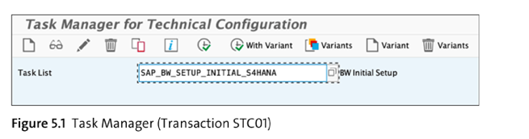
- task runs several steps
    - setting SAP BW client
    - installing SAP BW content
    - performing several checks and activations steps
- it typically runs 15 mins
- if some tasks fails, resolve them and activate through <b>STC02</b>
  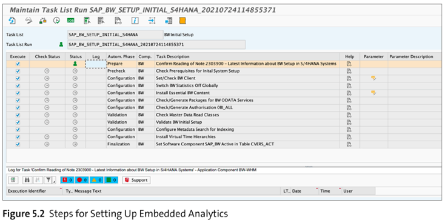


### Activate Enterprise Search

- Enterprise search helps you find apps and business objects from the search bar on the SAP Fiori launchpad


### Activation Enterprise Search
- task <b>SAP_ESH_INITIAL_SETUP_WRK_CLIENT</b>
- check parameters of task dpending on your scenario, e.g.: TREX or SAP HANA DB
  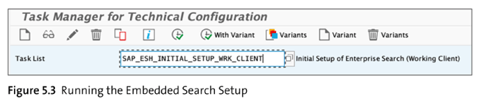
- you can check the logs in <b>STC02</b> and task <b>SAP_ESH_CONSISTENCY_CHECK</b> (run as background job, top of the screen)
  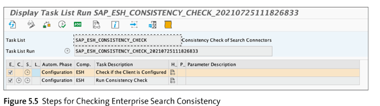


## 3. Activate SAP Gateway and SAP Fiori

### Activation  SAP Gateway and SAP Fiori
- task <b>SAP_GW_FIORI_ERP_ONE_CLNT_SETUP</b> in <b>STC01</b>
- <b>only relevant for embedded setup</b>
- this task is collection of following 5 tasks:
    - SAP_GATEWAY_BASIC_CONFIG
    - SAP_FIORI_LAUNCHPAD_INIT_SETUP
    - /UI5/SCHEDULE_JOB_UPDATE_CACHE
    - SAP_GATEWAY_ACTIVATE_ODATA_SERV
    - SAP_BASIS_ACTIVATE_ICF_NODES

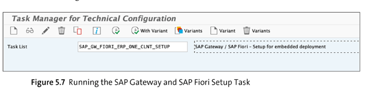

## 4. Activate and Configure the SAP Fiori Launchpad
- task <b>SAP_FIORI_FOUNDATION_S4</b> in <b>STC01</b>
- activate OData services and ICF framework
- will generate user and admin roles
- after success: transaction <b>/n/ui2/flp</b>
- URL: <i>http://<server>:<port>/.../sap/bc/ui2/flp</i>

[<- Back to TOP](#Content)

-----

### Spaces_Pages

[<- Back to TOP](#Content)


With SAP S/4HANA 2020 and FES 2020, SAP introduced a new concept for organizing the SAP Fiori tiles on the SAP Fiori launchpad called spaces and pages.

SpacesA space represents a work area that maps to one or more business roles, and each space can be structured in a number of pages. By clicking on the space, a dropdown will appear and show the pages available in this space. For example, the Sales Management space in Figure 5.27 consists of three pages: Sales Planning and Analytics, Sales Rebates, and Sales Commissions and Incentives, as shown in the menu bar dropdown.

Pages
A page can be just that, a single page with no further structuring except adding the relevant tiles, or you can create some logical structuring in the form of sections.

Sections
You can have one or more sections in a page to help structure the launchpad even more. In each section, you can add tiles. Some people see sections as similar to groups in the old layout.

Tiles
The tile hasn’t changed in this new layout and remains the simplest entity.

In the old homepage concept, you assigned the catalog and group to your Transaction PFCG role. This is still valid in the new concept with spaces and pages, but now you also assign the space to the role. At least for a period of time, you as administrator can choose to use either groups or spaces. However, over time, groups will disappear from SAP S/4HANA, so you might as well just get started with spaces and pages if you’re on SAP S/4HANA 2020.

Prerequisites

2 new apps: ```Manage Launchpad Spaces/Manage Launchpad Pages```

This group is part of the SAP standard role: SAP_FLP_ADMIN. Assign the Z-role to your user. In addition, part of the task is the activation of four OData services needed for the admin apps to work:

OData Service	Part of Standard Role	Description
FDM_SPACE_REPOSITORY_CUST_SRV	SAP_FLP_ADMIN	Read/write access mange spaces
FDM_PAGE_REPOSITORY_CUST_SRV	SAP_FLP_ADMIN	Read/write access mange pages
FDM_PAGE_RUNTIME_SRV	SAP_FLP_USER	Enable users to access spaces and pages
FDM_TRANSPORT_SRV	SAP_FLP_ADMIN	Transport role for spaces and page

The last thing you need before getting started with spaces is to enable the functionality (unless you did that as part of task SAP_FIORI_FOUNDATION_S4). To do so, run Transaction /UI2/FLP_SYS_CONF, and add a new entry.

SAP Fiori Launchpad Property ID	Category	Description	Type	Property value
SPACES_ENABLE_USER	Auto-filled	Auto-filled	Auto-filled	True
Table 5.3     Parameter to Enable the Switch to Spaces

Copy Spaces

With the Manage Launchpad Spaces app, you manage all the spaces in the system—both SAP standard-delivered spaces and custom-built spaces.

The SAP-Delivered list contains all the standard spaces and can’t be changed; they can only be used as is or copied to a customer space by using the standard one as a template.

Enter and search for the space called “SAP_SFIN_SP_GL_ACCOUNTANT_GRP”, select it as shown in Figure 5.31, and then click on the Copy button.

At the complete process:

You’ll notice that there is no role assigned to the space at this point. This needs to be done in Transaction PFCG just like you assign catalog and groups.

Assign Spaces:

Go to Transaction ```PFCG```, and open role ```Z_BR_GL_ACCOUNTANT_GRP``` in edit mode. In the Menu tab, the first entry is the standard space. You can verify this by double-clicking on the role. In the Node Details area, you can see the Object ID SAP_SFIN_SP_GL_ACCOUNTANT_GRP.

You need to assign the new Z-space you just created. Click on the Transaction button, and navigate to SAP Fiori Launchpad • Launchpad Space

In the popup window, search for the space you just created, and select it. You’ll automatically return to the Menu tab and now you’ll see two spaces—the standard space and the custom space—with the same name, Group Reporting. They have the same name because you didn’t provide a new name, only a new ID, when copying the space. To avoid providing two spaces to end users, you should delete the standard space and only keep the custom one.

Select the standard space, and simply delete it (using the stop sign icon that will appear after selecting the space)—ensure you’re deleting the standard one and not the custom one. You can check this in the object ID. Save your role when you’re finished.

To verify that the role is assigned, return to the Manage Launchpad Spaces app, and select the new space Z_SFIN_SP_GL_ACCOUNTANT_GRP. Click on it to open the details view, and click on the Roles tab to see the newly assigned role.

Create Spaces:


On the SAP Fiori launchpad, open the Manage Launchpad Spaces app. By default, it will open the Customer-Created tab and show a list of all the spaces that have been built in the system, either using a standard SAP space or from scratch. Click on the Create button to arrive at the Create Space popup, as shown in Figure 5.39, where you can fill in the Space ID, Space Description, and Space Title you want to use. Follow the same format we discussed previously for Figure 5.29.

In the process, you also get the option to create a page as well. Select the Also create a page option because you’ll need a page in any case, so you might as well create it in the same process. Finally, select a Transport, so you can transport the space and page later.

The last step is to assign a role to the space via Transaction PFCG just like you did for creating a space based on an SAP-delivered space.


[<- Back to TOP](#Content)

-----

### ERP_R3

[<- Back to TOP](#Content)


To set up and activate the infrastructure to support SAP Fiori apps, the following activities (described at a high level) need to be performed on an SAP Business Suite system:
1. Creating and maintaining SAP Fiori users
2. Performing basic configuration
3. Connecting the FES to the BES
4. Configuring SAP Web Dispatcher and embedded search
5. Setting up the SAP Fiori launchpad and SAP Fiori launchpad designer
6. Accessing the launchpad for the first time

| Task | Task List | Description |
|----|----|----|
| 1	SAP frontend – basic configuration | SAP_GATEWAY_BASIC_CONFIG |	This task is used to perform basic configuration of the FES.|
| 2	Configure trust between the BES and FES | 	SAP_SAP2GATEWAY_TRUSTED_CONFIG |	This task is executed on the backend to create a trusted connection.|
| 3	Add the backend system	| SAP_GATEWAY_ADD_SYSTEM| This task is used on the FES to finish the setup of the trust between the two systems.|
| 4	SAP Gateway – Maintain system alias	| SAP_GATEWAY_ADD_SYSTEM_ALIAS | This task must be executed on the FES and creates a system alias used in the RFCs.|
| 5	SAP Gateway – Activate OData services |	SAP_GATEWAY_ACTIVATE_ODATA_SERV |	This task is executed on the FES to activate all the OData services needed (explained in more detail in Section 4.4).|
| 6	SAP Basis – Activate HTTP services (Transaction SICF) |	SAP_BASIS_ACTIVATE_ICF_NODES |	This task activates frontend services providing access to web resources (explained in more detail in Section 4.4).|
| 7	SAP Fiori launchpad initial setup | 	SAP_FIORI_LAUNCHPAD_INIT_SETUP | This task activates the SAP Fiori launchpad.|
| 8	Enable embedded search on work clients |	SAP_ESH_INITIAL_SETUP_WRK_CLIENT | This task is used to do the initial configuration of enterprise search.|
| 9	Merge tasks 1, 5, 6, and 7 |	SAP_GW_FIORI_ERP_ONE_CLNT_SETUP	| This task is used if you have an embedded landscape, saving some time |


[<- Back to TOP](#Content)

-----

### Federation

[<- Back to TOP](#Content)


### Requirements and Prerequisite for Federation

There are several ways to integrate business content into your SAP BTP subaccount:
* Federation of remote content providers (topic of this note)
* Federation of SAP BTP content providers (do not use federation, see BTP Launchpad Service )
* Manual integration of apps (do not use federation, see BTP Launchpad Service)

A content provider is a system that exposes or makes content available so it can be integrated into the SAP Launchpad service on SAP BTP.

SAP calls, for example, an on-premise SAP S/4HANA 2020 system a remote content provider because it requires the system administrator to expose the required content. This content is typically the business roles in the SAP S/4HANA system, for example, role ```Z_BR_GL_ACCOUNTANT_GRP```, which you activated earlier.


<u>Admin must also create design-time and runtime destinations in the subaccount on SAP BTP. </u>
* The design-time destination is used to fetch the exposed content
* Tthe runtime destination is used to run the content, for example, when User launches an app and update a sales order. Updating the sales order is done using the runtime destination.

The remote content providers can be both cloud solutions and on-premise systems.

As mentioned, all content exposed is done on the role level; this includes apps, groups, and catalogs.

The administrator needs to create or update the launchpad parameter ```EXPOSURE_SYSTEM_ALIASES_MODE``` to CLEAR in the on-premise system. Setting this parameter to CLEAR means that the system aliases are cleared during exposure of content to the SAP Launchpad service.

Execute Transaction ```/UI2/FLP_SYS_CONF``` to add the parameter by creating a new entry with the property ID ```EXPOSURE_SYSTEM_ALIASES_MODE``` and value CLEAR.

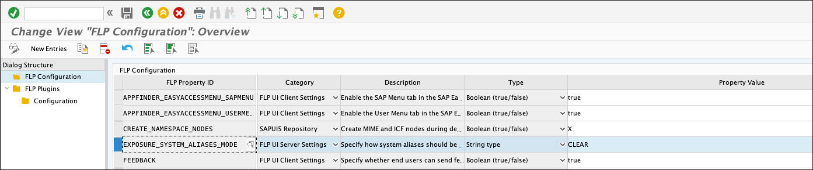


Because this content is being ```exposed to the Internet via SAP BTP```, you need to protect the SAP S/4HANA system against clickjacking attacks. To activate the clickjacking protection, you can use the Unified Connectivity Tool (UCON) setup whitelist scenario process. Call Transaction ```UCONCOCKPIT```, and check whether the HTTP Whitelist Scenario is activated by choosing it from the Scenario dropdown.

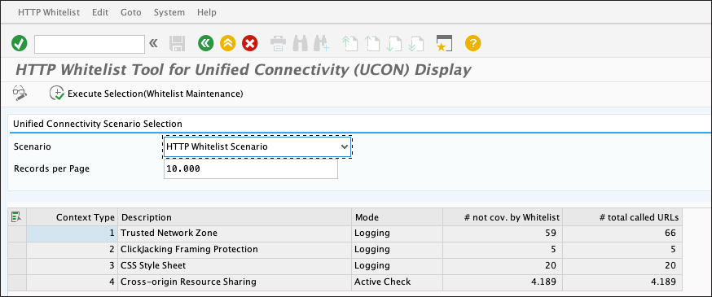

Last Prerequisite is activation of following services in S/4HANA transaction ```SICF``` :
```
/sap/public/bc/uics/whitelist 
/sap/bc/ui2/app_index 
/sap/bc/ui2/cdm3
```

---

# Working with the Common Data Model

Bringing data together from multiple sources and applications can be a nightmare. Without a common foundation on how to share and exchange data, it can be very time-consuming to ensure that the right data is exchanged.


The ```common data``` model simplifies the process by providing a shared data language for business and analytical applications such as SAP Fiori apps. The common data model is a collection of predefined schemas, including entities, attributes, and relationships, and was defined by Microsoft, SAP, and other leading companies. In SAP terms, entities or objects include roles, apps, groups, catalogs, spaces, and URL templates.

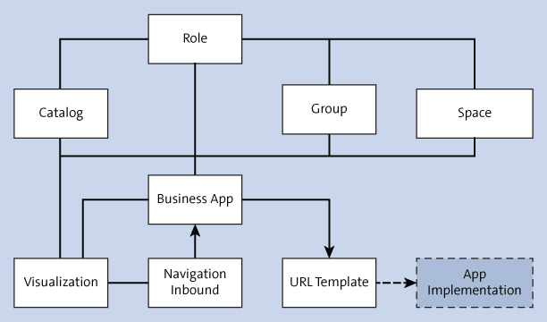


```
!!! NOTE !!!
Do not assign more than 3000 apps to any given role. 

```

Business apps can be seen as a business entity and need to fulfill a business purpose or task. The main entities of an app are target applications that implement the URL template and the visualization, that is, how the app is rendered.


URL templates contain URL patterns, parameters, and needed configuration. The goal of the URL template is to allow the integration of apps without the need for specific client-side code, which is code on the SAP Launchpad service that needs to be executed at runtime. The URL template can simply be referenced instead of an app resource.

---


[<- Back to TOP](#Content)

-----

### Exposing_Fiori

[<- Back to TOP](#Content)


```Business roles``` is the keyword in SAP S/4HANA and SAP Fiori, and this is also the case when exposing content to the SAP Launchpad service. This means you don’t expose individual SAP Fiori apps but expose business roles, app, catalogs, groups, and spaces/pages as a whole.


```
!!! NOTE !!!

Composite roles and derived roles aren’t supported at the time of writing. You can visit https://help.sap.com and search for the “Launchpad Service” for the latest updates. There are a few other limitations/restrictions to look out for as well.

```

### An overview of the end-to-end steps for integrating content from an SAP S/4HANA system:

|Step | Description| Reference |
|------|-----|-----|
| Prerequisites | Configure clickjacking and set the expose parameter | [Federation](launchpad_federaton.md)|
| Expose the role(s) | Expose the business role from the SAP S/4HANA system | [Exposing](launchpad_exposing.md)|
| Configure the destination | Create the design-time and runtime destination in the SAP BTP cockpit | |
| Define the content provider | Define the content provider and add roles to the subaccount in the SAP Launchpad service site manager.| |
| Assign roles to the SAP Launchpad site | Assign roles in the site setting in the SAP Launchpad service site | |
| Assign role collection to a user | Assign the role collection that was added to My Content in the SAP Launchpad service site via the SAP BTP cockpit | |

With FES 2020 and FES 6.0 SP04, a new transaction was introduced to enable the exposure of content to the SAP Launchpad service. Transaction ```/UI2/CDM3_EXP_SCOPE``` is used to display, edit, and expose roles to the SAP Launchpad service.

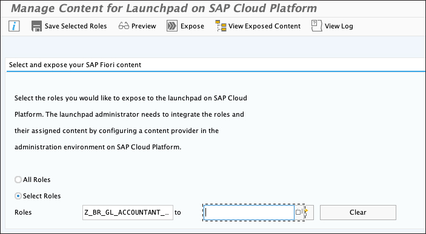

You need Transaction PFCG role ```SAP_FLP_ADMIN``` assigned to your user to launch the transaction. The end user will need role ```SAP_FLP_EXP_USER``` to view the exposed content.

To expose role, choose the Select Roles radio button, and either paste the role name in the field or search for it in the dropdown box. There is an option to add multiple roles at one time by clicking the Multiple Selection option.

Save your selection by clicking Save Selected Roles. It’s good practice to do a preview before you expose the content, to verify that all the expected roles are included in the selection. To do this, click on the Preview button.

When you’re satisfied with the content to run the actual exposure, <u>return to the first screen</u>, and click on ```Expose```.

On completion, an overview is displayed like that shown in Figure 5.48; if there are any issues, you can see detailed log information for troubleshooting.

The selected role is now exposed and is ready to be consumed by the SAP Launchpad service. To verify that the JSON file is generated correctly, you can access the entity service via ```https://<host name>:<port>/sap/bc/ui2/cdm3/entities```, and if you install a JSON format plug-in in your browser, you’ll see the response in a nicely formatted way.


[<- Back to TOP](#Content)

-----

### Activating_Fiori_Apps

[<- Back to TOP](#Content)

### Activating a Single SAP Fiori Application


The identification and selection of relevant SAP Fiori apps is normally something the business is responsible for and not something we’ll cover in this book.

### Register OData service.


Transaction ```/n/IWFND/MAINT_SERVICES``` (Activate and Maintain Services) is used to maintain all registered OData services on the SAP Gateway server, to register and activate services, and to delete the registered services. To register our OData service so that it can be consumed as a data service, call the transaction, and click on the Add Service button

### Activate ICF Nodes (SICF)

The last step in the installation of an SAP Fiori app is activation of the needed Business Server Pages (BSP) services. These are our SAPUI5 applications available as BSP repository objects in ABAP and also available as an ICF node.

### Building an SAP Fiori Role
ToDo: 4.3


### Mass Activation of SICF
ToDo: 4.4.2.

[<- Back to TOP](#Content)

-----

### FLP_Transactions

[<- Back to TOP](#Content)


|Transcation|Description|
| ----------- | ----------- |
|/UI2/CUST| Customization of UI technologies|  
|/UI2/CHIP|Chip Registration|
|/UI2/CUST|Customizing of UI Technologies|
|/UI2/FLC|Fiori Launchpad Checks|
|/UI2/FLIA|	Fiori Launchpad Intent Analyis|
|/UI2/FLP|	SAP Fiori Launchpad|
|/UI2/FLP_CONTCHECK|	Fiori Launchpad – Content Checks|
|/UI2/FLP_INTENTCHECK|	Fiori Launchpad – Intent Checks|
|/UI2/FLPD_CONF|	Fiori Launchpad Designer (cross-client)|
|/UI2/FLPD_CUST|	Fiori Launchpad Designer (client-specific)|
|/UI2/GW_ACTIVATE|	Gateway – Activation|
|/UI2/GW_APPS_LOG|	Gateway – Application Log|
|/UI2/GW_ERR_LOG|	Gateway – Error Log|
|/UI2/GW_MAINT_SRV|	Gateway – Service Maintenance|
|/UI2/GW_SYS_ALIAS|	Gateway – Manage SAP System Alias|
|/UI2/NAV|	Register navigation objects|
|/UI2/NAVPROV|	Define navigation provider|
|/UI2/NWBC|	Start UI2 NWBC|
|/UI2/NWBC_CFG_CUST|	NWBC Configuration (Customer)|
|/UI2/NWBC_CFG_P_CUST|	NWBC Config: Define Parameter (Cust)|
|/UI2/NWBC_CFG_P_SAP|	NWBC Config: Define Parameter (SAP)|
|/UI2/NWBC_CFG_SAP|	NWBC Configuration (SAP)|
|/UI2/PERS_DEL|	Cleanup Personalisatation Service|
|/UI2/POWL|	Register POWL for OData consumption|
|/UI2/SEMOBJ|	Define Semantic Object – Customer|
|/UI2/SEMOBJ_SAP |	Define Semantic Object – SAP|


## SE38
|Report|Description|
| ----------- | ----------- |
|/UI5/UI5_REPOSITORY_LOAD| Download/Upload SAPUI5 Rpository from SAP|


# Chip

|Report / Transaction| Description|
| ----------- | ----------- |
|/n/UI2/CHIP| Chip Registration|


### Transaction:
|Transaction|Description|
|------|-----|
|/UI2/FLPCM_CONF| |
|/UI2/FLPCM_CUST| | 


[<- Back to TOP](#Content)

-----

### Translate_FLP

[<- Back to TOP](#Content)


0. In Fiori Designer, find ID of the object (e.g.: tile)

1.

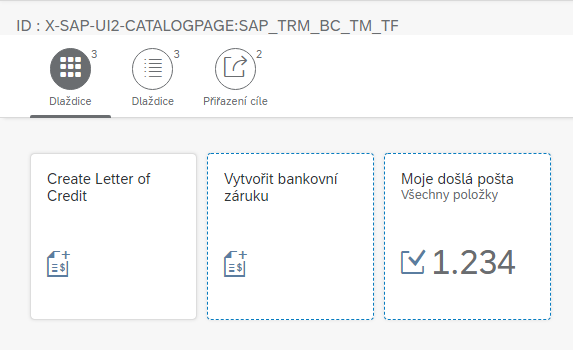

3. SE63

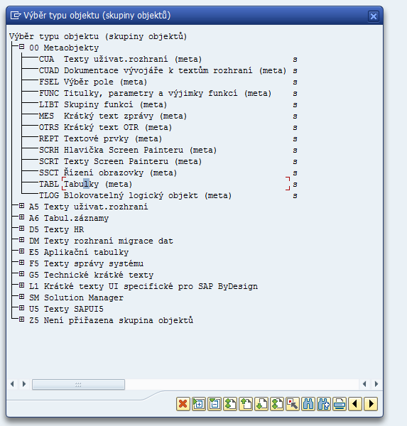

3. Translation -> ABAP Objects -> Short Text
3. Object Name: WDY_CONF_USERT2

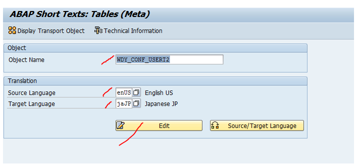

4. Do the translation
5. SE38 -> /UI2/INVALIDATE_CLIENT_CACHES

[<- Back to TOP](#Content)

-----

### SAP_Notes

[<- Back to TOP](#Content)


|Note|Description|
|------|-----|
|304635| |
|2712785| |

[<- Back to TOP](#Content)

-----


### FLP_Theme

[<- Back to TOP](#Content)

### Theme
### Transaction
- /UI5/THEME_TOOL

### Transport
For more information on prerequisites, see SAP Note 2066504.

1. Start the Tool for Customer Themes Maintenance using transaction /UI5/THEME_TOOL.
2. Navigate to the theme you want to transport.
3. Select Transport and choose Choose (F2).


### Default Theme
Start transaction <b>/UI2/NWBC_CFG_CUST</b> and look for the key/value match <b>SAP_FLP</b> at parameter <b>THEME</b>,
then change or create the entry according to the ID you’ve chosen at creating your new theme.

### Reference
-[Theme Designer](https://help.sap.com/docs/UI_ADD-ON_FOR_SAP_NETWEAVER_20/3b63028937934758a0ee73b54c3fc0c3/a118094264684230bb6510045b5b5b7c.html?version=2.06&locale=en-US)


[<- Back to TOP](#Content)

-----

### FLP_Health_Checks

[<- Back to TOP](#Content)


Checks are fit for S/4HANA 2021 and above. You should activate at least one role to test FLP.

## Content
1. Your Launchpad URL works
2. Context-Sensitive Help is Available
3. Search on objects is available
4. Notifications dialog works without error
5. Spaces and Pages layout mode is active
6. Settings are working
7. Launching any SAP Fiori app works
8. Launching any classic UI works
9. App Support is working
10. Performance is acceptable

----


### 1. Your Launchpad URL works

When you launch your launchpad URL you should be able to login to your SAP Fiori Launchpad and see your
entry page.

Your URL should be:
```
https://<host>:<port>/sap/bc/ui2/flp?sap-client=<client>&sap-language=<language>
```
<b>IMPORTANT:</b> <i>You can use the basis help transaction ```/UI2/FLP``` to generate the URL. However, once you have the
URL it should be bookmarked in your web browser or included as a link on your Intranet or Internet portal. You
should NOT continue to use transaction ```/UI2/FLP``` as this adds an unnecessary point of navigation.</i>

----

### 2. Context-Sensitive Help is Available

When you start up your launchpad, the context-sensitive help should be available straight away. This is
something you need immediately to help you become familiar with your launchpad.

<b>IMPORTANT:</b> <i>The context-sensitive help shown here is provided as part of your SAP S/4HANA system, i.e. there is
no additional licence or subscription required. If you later wish to tailor or add new content to the help
documentation, you will need to consider SAP Enable Now.</i>

Help icon appears in the top line of the SAP Fiori launchpad. next tu "lupa" a "zvonecek".

Not there? Help is here:
* 3022494 -  SAP S/4HANA (On Premise) 2020 / SAP_UI 7.56 : Configure Web Assistant without SAP Web Dispatcher
* 3128026 – Fiori In-Application Help is missing the question mark ? (Web Assistant question mark missing) or un-editable (unknown)
* [Simplified Configuration of Help Links in SAP S/4HANA](https://blogs.sap.com/2020/07/27/simplified-configuration-of-help-links-in-sap-s-4hana/)
* [SAP Fiori for SAP S/4HANA – How to setup the User Assistant in your S/4HANA Fiori launchpad](https://blogs.sap.com/2020/01/07/sap-fiori-for-sap-s-4hana-how-to-setup-the-user-assistant-in-your-s-4hana-fiori-launchpad/)

-----

### 3. Search on objects is available

When you select the magnifying glass you will see a dropdown list of available Search objects.

* [SAP Fiori for SAP S/4HANA – Enterprise Search Optimization](https://blogs.sap.com/2020/12/10/sap-fiori-for-sap-s-4hana-enterprise-search-optimization/)
* [SAP Fiori for SAP S/4HANA – Activate SAP Fiori in 1 day or less – the video playlist and FAQ](https://blogs.sap.com/2021/11/03/sap-fiori-for-sap-s-4hana-activate-sap-fiori-in-1-day-or-less-the-video-playlist-and-faq/)
* [SAP Fiori for SAP S/4HANA – Resolving duplicate search objects](https://blogs.sap.com/2021/11/11/sap-fiori-for-sap-s-4hana-resolving-duplicate-search-objects/)
* [SAP Fiori for SAP S/4HANA –Limit Search Object Access in Fiori Launchpad made easier](https://blogs.sap.com/2022/03/13/sap-fiori-for-sap-s-4hana-limit-search-object-access-in-fiori-launchpad-made-easier/)

-----

### 4. Notifications dialog works without error

When you select the notifications bell icon, the notifications dialog appears.  You should not see any errors.

However to fully check notifications are correctly configured run the GUI transaction /IWNGW/BEP_DEMO to generate a demo notification to that user.


Notifications not working?

* [Enabling Notifications in the SAP Fiori launchpad](https://help.sap.com/viewer/a7b390faab1140c087b8926571e942b7/latest/en-US/b39cf9ed70674d08b2f227e7d2dc9c91.html)
* [How to set up notification step by step](https://wiki.scn.sap.com/wiki/display/SAPMOB/How+to+Setup+Notifications+in+Fiori+2.0+step-by-step)
* [SAP Note 2729492 – Configuring notifications in Fiori Launchpad and known restrictions](https://launchpad.support.sap.com/#/notes/2729492)
* [SAP Fiori for SAP S/4HANA – Notification Center – Part 1 – Activation](https://blogs.sap.com/2017/02/13/leading-s4hana-ux-notification-center-part-1-activation/)
* [SAP Fiori for SAP S/4HANA – Notification Center – Part 2 – Providing Notifications](https://blogs.sap.com/2017/02/14/leading-s4hana-ux-notification-center-part-2-providing-notifications/)

<b>IMPORTANT:</b> <i> Which notification providers should be activated? The easiest option is to activate all notification providers. The provider will only be called if your users are using the related process, at which point the provider will decide whether to add a notification to the notification channel queue. So there is no pragmatic downside to activating notification providers that are never used.</i>

-----

### 5. Spaces and Pages layout mode is active

Groups are deprecated from SAP S/4HANA 2021.

Refer to:
* [What’s New Viewer for ABAP Platform – SAP Fiori Launchpad Home Page Deprecated for the ABAP Platform 2021](https://help.sap.com/doc/34796706f38646f68d51a0fa0d4636e4/100/en-US/02aa13a2ac514762976b6971d06d5ff8.html)
* [SAP Fiori Launchpad Home Page Deprecated as of SAP S/4HANA 2021 FPS01](https://help.sap.com/doc/34796706f38646f68d51a0fa0d4636e4/100/en-US/cf27dceb447b43099026b46b69b1b16f.html)

Spaces and Pages offer significant advantages over Groups such as:
* They are easier to understand
* They are easier to maintain and manage over time
* They are easier to align with security authorizations
* They have reduced interference on maintenance of security authorization roles
* Changes to spaces and pages are automatically merged with user personalizations
* Future SAP Fiori functionality, such as the Horizon Theme, will only be available with Spaces and Pages.


Please make sure that when you run the task list SAP_FIORI_FOUNDATION_S4 you explicitly include the optional tasks for Spaces and Pages – i.e. select the checkbox in front of the task.

Make sure you adjust your Launchpad Configuration Parameters for spaces:
* SPACES = true (default layout mode is spaces)
* SPACES_ENABLE_USER = true (user has the option to toggle between spaces and groups mode)
* SPACES_MYHOME = true (show the My Home page by default)

<b>IMPORTANT</b>: <i>If you are upgrading to SAP S/4HANA 2020 or higher, then it is a good idea to make spaces available, rather than the default layout mode. You can then give the user the option to try spaces through their Settings by setting the Launchpad Configuration Parameter SPACES_ENABLE_USER to true. This gives you some flexibility to explore differences and discuss the pace of change appropriate to your organization.</i>

<u>How to fix a Role that does not have a Space</u>:
* You may have some custom business roles that do not yet have a space. Occasionally you may find SAP delivered roles that do not yet have a space.
* You will need to use the Fiori Foundation Admin user to perform these tasks.
* Create a space for the role in SAP Fiori app F4834 Manage Launchpad Spaces
* Assign your space to the role – in transaction PFCG.
* For each Group assigned to the role, use the migration tool Create Launchpad Pages from Groups which is ABAP Web Dynpro ```/UI2/FDM_GTP```
* Assign your page(s) to the space in SAP Fiori app F4512 Manage Launchpad Spaces.
* Retest your role’s layout

-----

### 6. Settings are working

You should see the Settings option in the User Actions menu (also known as the Profile menu).

As a general guideline, the following sections should always appear in the Settings dialog:
* User Account
* Appearance
* Spaces and Pages
* User Activities
* Language and Region
* Default Values
* Notifications

Settings dialog not working?
* [Activating User Defaults in SAP S/4HANA](https://blogs.sap.com/2017/09/14/activating-user-defaults-in-sap-s4hana/)
* [SAP Fiori app F2800 Configure Personalized Search](https://fioriappslibrary.hana.ondemand.com/sap/fix/externalViewer/#/detail/Apps('F2800')/S22OP)

-----

### 7. Launching any SAP Fiori app works

You will need at least some apps to be active to complete this test.

Personally, I like to use a Manage or Monitor app as these are simple apps that typically require no  configuration, just some data to show.

Launch of SAP Fiori apps not working?
* Your SAP Web Dispatcher
* OData
* Your HTTP allow list
* SICF services have been activated for HTTP/HTTPS
* Your single signon trust configuration
* Your system aliases

You will also need to check your SAP Fiori Foundation configuration is complete.

As a first step, check in transaction STC02 if task lists SAP_GW_FIORI_ERP_ONE_CLNT_SETUP and SAP_FIORI_FOUNDATION_S4 were run successfully. These task lists encapsulate the main tasks needed, so if anything failed or was missing, check those tasks first.

-----

### 8. Launching any classic UI works

Most customers will want to use some GUI transactions and some WebDynpro ABAP applications as part of their user experience mix for a role.

<b>IMPORTANT</b>: <i>By default, classic UIs should launch in the same browser tab, and should NOT create a second browser tab.  This is controlled by Fiori launchpad configuration parameters.</i>

* [SAP Fiori for SAP S/4HANA – Calling GUI & Web Dynpro ABAP without opening a new tab](https://blogs.sap.com/2019/01/29/fiori-for-s4hana-calling-gui-web-dynpro-abap-without-opening-a-new-tab/)

Launch of SAP GUI & WebDynpro apps not working?
* Your SAP Web Dispatcher
* Your HTTP allow list
* SICF services have been activated for HTTP/HTTPS
* Your single signon trust configuration
* Your system aliases, different then Fiori ... RFC type is different

-----

### 9. App Support is working

<b>IMPORTANT</b>: <i>To test App Support you must be have launched an app. App Support does not show on the launchpad page.</i>

When you select the App Support option, the App support dialog must open, and not show service errors.  You should see several sections in the left-hand pane, such as:
* App Information
* Embedded Server
* Authorization Errors
* Gateway Errors
* Runtime Errors

App Support not working?
* Refer to [Setting up App Support](https://help.sap.com/viewer/a7b390faab1140c087b8926571e942b7/latest/en-US/04bc7b47932f4e689f7911901087a8f2.html) in the SAP Fiori launchpad guide in the SAP Help Portal.
* Check if the App Support service is active.
* Check if The launchpad plugin has been defined in transaction /UI2/FLP_CONF_DEF and activated in transaction /UI2/FLP_CUS_CONF.
* Check if the authorization object S_FLP_AS has been assigned to permit users to download logs so they can send them to your Support team.
* Check if the App Support plugin is included in the user’s permissions.
* Check the user has IWSG and IWSV authorization object permissions to use the service (ideally this should be part of the generic Fiori Foundation User role given to every user).
* Alternatively, you can assign a custom business catalog, referencing the technical catalog SAP_TC_FLP_COMMON.
* [SAP Fiori for SAP S/4HANA – Support Best Practice Recommendations](https://blogs.sap.com/2022/03/17/sap-fiori-for-sap-s-4hana-support-best-practice-recommendations/)


-----

### 10. Performance is acceptable

Performance is a critical part of usability and something that SAP continually works to improve.

* Ideally most navigations within an app should be sub-second.
* Launching apps, UIs and other features should take only a second or two.
* As a general guideline, even worst-case response times should still be no more than a few seconds.
* You should consider monitoring for HANA CPU Time Violations and excessive time in the WAN as these are the most common identifiers of known issues
    * SAP NOTE 3090070 – SAP S/4HANA 2021 FPS0: Performance Restrictions.

When performance testing, remember the impact of caching on your user session.
* If the first time is slow, try it again, and it should be faster for every subsequent time after the very first time.
* Running your tests again is in the same session is a good quick test to help narrow down whether performance for an app/UI or feature is a persistent problem, or only related to first usage per session.
* You can also use this approach to help you set expectations with your team and your users as they start to explore the system, while you look to further improve performance wherever you can.

Be aware that performance in web technologies involves a LOT of factors.  Some of these are under your control, and some depend on your infrastructure, such as your web browser settings, your network bandwidth, latency to your data center, your WAN network, your system sizing, your HANA database configuration, etc.

For the latest performance best practices refer to blog posts:
* [SAP Fiori for SAP S/4HANA – Performance Optimization and Best Practice – Part 1 Tools and Tracing](https://blogs.sap.com/2021/09/21/sap-fiori-for-sap-s-4hana-performance-optimization-and-best-practice-part-1-tools-and-tracing/)
* [SAP Fiori for SAP S/4HANA – Performance Optimization and Best Practice – Part 2 Architecture & Other Considerations](https://blogs.sap.com/2021/11/22/sap-fiori-for-sap-s-4hana-performance-optimization-and-best-practice-part-2-architecture-other-considerations/)

You should keep in mind that there are known performance exceptions, for example:
* Launchpad uses a progressive loading approach, i.e. you can start to use any feature available while the remaining features are still loading
* Some apps may have performance challenges – particularly where there are complex analytics over very high data volumes

With respect to individual apps, check for SAP Notes with the list of exceptions for your release, where there are known delays. For example, SAP Note 3090070 – SAP S/4HANA 2021 FPS0: Performance Restrictions. Typically, any non-critical delays reported by customers are remediated in subsequent Feature Pack Stacks, Support Pack Stacks, or releases, depending on the nature of the changes required.  You may notice that for some apps you can also improve times yourself by adjusting your settings, such as for your WAN or HANA CPU environment.

For classic UIs you should also check your launchpad configuration parameters have been set optimally. Refer to [Improving Navigation Performance for SAP GUI Applications](https://help.sap.com/viewer/a7b390faab1140c087b8926571e942b7/latest/en-US/bb5b954f0dad42dda1fd50b5058b5556.html)

Start with a HTTPWatchTrace to get a quick breakdown of where time is being spent. Identify the percentage of time spent in network/bandwith, WAN, and other components external to your SAP S/4HANA system.


Then use the new STATS_FE tool to help monitor what is going on for web applications within your system. Refer to blog post: [Measure your Application’s Performance and Resource Consumption: Evaluate Statistics Records with Transaction STATS](https://blogs.sap.com/2021/12/23/measure-your-applications-performance-and-resource-consumption-evaluate-statistics-records-with-transaction-stats/)
and [Use Transaction STATS_FE to Analyze the Performance of your Web Application](https://blogs.sap.com/2022/01/27/use-transaction-stats_fe-to-analyze-the-performance-of-your-web-application/)

Understanding progressive loading of the launchpad

Progressive loading essentially means that the launchpad is loaded in stages. You can interact with any of the elements you can see even while others are still loading. The below is what is observed  in SAP S/4HANA 2021:

1. You see the shell bar and main content area with the logo, Home navigation and user actions first.
2. The initial page, such as the My Home Page is loaded, and the space menu tabs appear
3. The remaining shell features (search, notifications, help) are added.
4. Any additional pages are added.

Running the FLP Health Check task list

```STC01 -> /UI2/FLP_HEALTH_CHECKS```


<b>Check your Fiori Foundation is in place</b>

Navigate to the Task List Run Monitor transaction STC02 to find previously run task lists. Check the SAP Fiori Foundation task list SAP_FIORI_FOUNDATION_S4 has been run successfully to successful completion (all icons are green squares).

<b>Check if the Fiori Foundation roles have been created</b>

There are 2 authorization roles you need to get you started:

* The role that grants every user access to the Fiori launchpad and main features
* The role that grants admin access to the Fiori launchpad content and layout tools

These roles are generated by the SAP Fiori Foundation task list SAP_FIORI_FOUNDATION_S4, task “Generate Fiori Foundation Roles” and by default are called, respectively:
* Z_FIORI_FOUNDATION_USER
* Z_FIORI_FOUNDATION_ADMIN

-----


[<- Back to TOP](#Content)

-----

### FLP_References

[<- Back to TOP](#Content)


- [SAP Fiori for SAP S/4HANA – Recommendations for transitioning users from SAP GUI to SAP Fiori](https://blogs.sap.com/2021/03/31/sap-fiori-for-sap-s-4hana-recommendations-for-transitioning-users-from-sap-gui-to-sap-fiori/)
- [SAP Fiori 3 update: evolution continues, with flat tiles and more – have a look, and learn how to find what’s new](https://blogs.sap.com/2021/05/05/sap-fiori-3-update-evolution-continues-with-flat-tiles-and-more-have-a-look-and-learn-how-to-find-whats-new/)
- [SAP Fiori for SAP S/4HANA – 3 simple use cases for Launchpad Content Aggregator](https://blogs.sap.com/2021/05/12/sap-fiori-for-sap-s-4hana-3-simple-use-cases-for-launchpad-content-aggregator/)
- [SAP Fiori for SAP S/4HANA – Creating your custom business roles – the end-to-end process and video playlist](https://blogs.sap.com/2021/06/24/sap-fiori-for-sap-s-4hana-creating-your-custom-business-roles-the-end-to-end-process-and-video-playlist/)
- [SAP Fiori for SAP S/4HANA – Adding Custom Content to Business Roles](https://blogs.sap.com/2020/08/19/sap-fiori-for-sap-s-4hana-adding-custom-content-to-business-roles/comment-page-1/#comment-631300)
- [How to set a theme parameter to SAP Fiori launchpad](https://blogs.sap.com/2014/05/16/how-to-set-a-theme-parameter-to-sap-fiori-launchpad/)
- [SAP Fiori Launchpad Customization](http://blog.sap-press.com/sap-fiori-launchpad-customization)
- [SAP Fiori for SAP S/4HANA – How to migrate from groups to spaces and pages](https://blogs.sap.com/2022/04/28/sap-fiori-for-sap-s-4hana-how-to-migrate-from-groups-to-spaces-and-pages/)
- [SAP Fiori for SAP S/4HANA – Migrating from groups to spaces and pages – Why, When, and Key Differences for Users](https://blogs.sap.com/2022/04/28/sap-fiori-for-sap-s-4hana-migrating-from-groups-to-spaces-and-pages-why-when-and-key-differences-for-users/)
- [Making UI Changes (Object Pages)](https://help.sap.com/docs/ABAP_PLATFORM_NEW/a7b390faab1140c087b8926571e942b7/54270a390b194c3e97be2424592c3352.html?locale=en-US)
- [How to Setup Notifications in Fiori 2.0 step-by-step](https://wiki.scn.sap.com/wiki/display/SAPMOB/How+to+Setup+Notifications+in+Fiori+2.0+step-by-step)
- [How to Create a Custom Role for Fiori Apps with Spaces and Pages in SAP S/4 HANA](https://www.youtube.com/watch?v=8akBWii9_KI)
- [New SAP Fiori launchpad content manager tool available for S/4HANA 1709 and 1809 customers](https://blogs.sap.com/2019/07/22/new-sap-fiori-launchpad-content-manager-tool-available-for-s4hana-1709-and-1809-customers/)
- [SAP Fiori Launchpad Content Manager](https://help.sap.com/docs/SAP%20Fiori%20launchpad/d4650bf68a9f4f67a1fda673f09926a9/1e569e00739946a1a974a46925dcd879.html)
- [Deliver Your First SAP Fiori Launchpad Site](https://developers.sap.com/mission.cp-starter-digitalexp-portal.html)
- [Deliver Your First SAP Launchpad Site (with integrated apps)](https://developers.sap.com/mission.launchpad-cf.html)
- [Develop Your First SAPUI5 Web App on Cloud Foundry](https://developers.sap.com/mission.sapui5-cf-first.html)
- [Enhance Your SAP Launchpad Site with Federated SAP S/4HANA Content](https://developers.sap.com/mission.launchpad-s4hana.html)
- [Develop a Fiori Launchpad App with Your Own Dev Tools](https://developers.sap.com/mission.sapui5-cf-launchpad.html)
- [SAP Fiori for SAP S/4HANA – 10 health checks for the SAP Fiori launchpad](https://blogs.sap.com/2022/04/08/sap-fiori-for-sap-s-4hana-10-health-checks-for-the-sap-fiori-launchpad/)
- [SAP Fiori for SAP S/4HANA – Creating your custom business roles – the end-to-end process and video playlist](https://blogs.sap.com/2021/06/24/sap-fiori-for-sap-s-4hana-creating-your-custom-business-roles-the-end-to-end-process-and-video-playlist/)
- [/UI5/APP_INDEX_CALCULATE  - Scheduling the Creation of the SAPUI5 Application Index](https://help.sap.com/viewer/d71464d9f3204ea8be1144d62acd9ac3/Fiori%20Tech%202.0%20(NW%207.52_FES%204.0%20SP01)%20Ship/en-US/e9161c5dff6346f0820a1f1329e108dd.html)
- [/UI5/SCHEDULE_JOB_UPDATE_CACHE - Scheduling Update of OData Metadata Caching](https://help.sap.com/viewer/d71464d9f3204ea8be1144d62acd9ac3/Fiori%20Tech%202.0%20(NW%207.52_FES%204.0%20SP01)%20Ship/en-US/6d6c453b1aaa49d394633a12ed52c1db.html)


[<- Back to TOP](#Content)

-----
