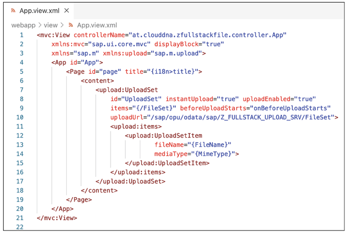
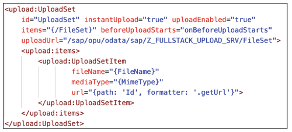

# File Uplaod in SAPUI5 

*Note: File Upload/Download for OData in OData Section*

---

Media entities and streams are the go-to way of handling files in an OData service. Available for OData V2/OData V4.

---

SAPUI5 provides designated controls for handling file upload & download. These fiels are transported as data streams with the help of OData media entities.


---

Additionally, ABAP RAP for OData V4 offers an easy way of annotating persistent fields to be usede for these media streams. 

----


## File Upload

1. Edit/enhance **manifest.json**

```
// in manifest.json

"dataSources": {
      "mainService": {
        "uri": "/sap/opu/odata/sap/Z_FULLSTACK_UPLOAD_SRV/",
        "type": "OData",
        "settings": {
          "annotations": [],
          "localUri": "localService/metadata.xml",
          "odataVersion": "2.0"
        }
      }
    }

// models section

 "models": {
      "i18n": {
        "type": "sap.ui.model.resource.ResourceModel",
        "settings": {
          "bundleName": "cz.cez.gosdemo.i18n.i18n"
        }
      },
      "": {
        "dataSource": "mainService",
        "preload": true,
        "settings": {}
      }
    },


```

2. We don't need much in our view. Basically, it's sufficient to include an UploadSet. There are a few attributes that need to be set:

* **items** -> This is the aggregation that we must bind the FileSet to so that the files are later also visible in the UploadSet.
* **uploadUrl** -> Here, we must specify which entity set is to be called up during the upload.
* **beforeUploadStarts** -> For this event, we have to store a function that sets the slug header in the request and sets the Cross-Site Request Forgery (CSRF) token in the request on the other.

In addition, a template must be specified in the aggregation for the items. here. In addition to the properties just men-tioned, other properties can of course also be specified.



```
onBeforeUploadStarts: function (oEvent) {
    this.oFileUploader = this.getView().byId("UploadSet");
    let HeaderSlug = new Item({
        key: "slug",
        text: oEvent.getParameter("item").getFileName()
    });

    let oCSRFHeader = new Item({
        key: "x-csrf-token",
        text: this.getView().getModel().getSecurityToken()
    }) ;

    this.oFileUploader.removeAllHeaderFields();
    this.oFileUploader.addHeaderField(oHeaderSlug);
    this.oFileUploader.addHeaderField(oCSRFHeader);
}
```


## File Download

First, we define a method in our controller that receives the primary key, that is, the ID, of a document. Based on this, we create the corresponding URL and return it. This is needed because in the UploadSet control, there is an option for specifying a URL, which is then displayed as a link.

```
getUrl: function(id){
    return `${this.getView().getModel().sServiceUrl}/FileSet(guid'${id}')/$value`;  
｝
```



## ABAP RAP (OData V4)

The ABAP RESTful application programming model provides the automatic handling of large objects or data streams. For these files to be automatically handled, database fields for the file itself, its MIME type (data type of the file), and the file name are required.