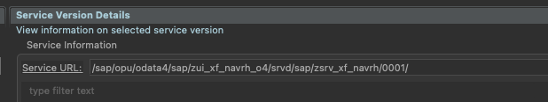

# Use Postman for SAP (cookie option)

1.  After logon to the SAP BTP, ABAP Environment system, open the service binding for the API you’d like to test
2.  Click on the **Service URL** link in the service binding of the WebAPI (OData V2 or OData V4)

3. You should see the service metadata in the browser. Refresh this tab of the browser with the **developer tools** of the browser open. 
4. Right-Click on the "...sap-client" in Network Tab 

5. Identify the HTTPS header property named "Cookie" and copy it

6. Open Postmand and create Environment and property "Cookie"

Import to Postman **File->Import**

----
*NOTE: Remember to assign this environment to your Postman session (in the top right corner).*

----

7. Assign the environment variable to your OData call

-----
*NOTE: n the Postman request go to the Headers section and create a new property called “Cookie” and assign the value from your environment variable via double-curly-brackets as displayed above.Save this request in a collection, and make sure to set this property in all your requests.*

-----

*Whenever the Cookie expires perform steps 1-4 and copy the value to environment variable. And you can keep testing for another 4 hours until it expires again.*

-----

Follow UP: [Syncing cookies](https://learning.postman.com/docs/sending-requests/capturing-request-data/syncing-cookies/#syncing-cookies-with-postman-interceptor)

[<- Back to Main](../../README.md)