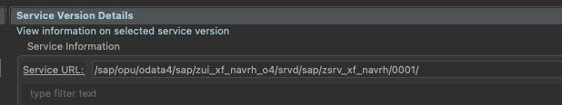
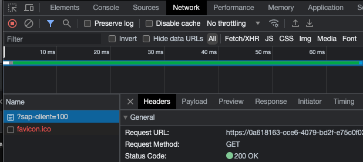
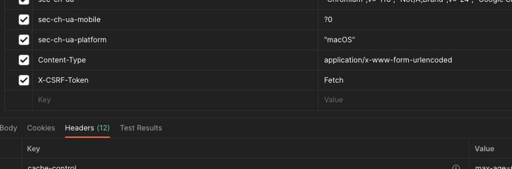

# Use Postman for SAP (sap-client option)


## SAP BTP ABAP environment 

### sap-client option
1.  After logon to the SAP BTP, ABAP Environment system, open the service binding for the API you’d like to test
2.  Click on the **Service URL** link in the service binding of the WebAPI (OData V2 or OData V4)

3. You should see the service metadata in the browser. Refresh this tab of the browser with the developer tools of the browser open. 
4. Right-Click on the "...sap-client" in Network Tab and select copy->copy as cURL

5. Import to Postman **File->Import**


### Fetch token for authentication and use this for testing

CSRF Tokens are used by the ABAP system on BTP to prevent CSRF attacks. The CSRF Token is a secret code generated by the server for a specific user. This would be difficult for an attacker to determine or predict. Since the token can’t be predicted easily, the attacker can’t construct a request with all necessary parameters needed by the server to successfully process such a request.


Here, the step intends to fetch the CSRF token of the same user that is logged on to the system:

1. Under the header tab of the request, add the headers for content type and X-CSRF-Token as follows and click send

```
    "Content-Type": "application/x-www-form-urlencoded",
    "X-CSRF-Token":"Fetch"
```




2. Replace the X-CSRF-Token header of the request with this token that is returned, and you should now be able to test different calls (e.g.: POST,...).

----
*NOTE: In case you get an unauthorized error after performing these steps it is likely due to timeout/expiration of the token or a problem with the cookies. You could re-import the request with the cookies as per above steps to resolve the issue.*

----


3. (Optional) When fetching the x-csrf-token, you can use environment variables to save the token. To do this, you need to create an "environment" and use this snippet in the "Tests" tab of the request to save the token

```
    var xcsrf = postman.getResponseHeader("x-csrf-token");
    postman.setEnvironmentVariable('x-csrf-token', xcsrf);
```

Then, in the following requests you can use this token in the request header with:

```
{{x-csrf-token}}
```


[<- Back to Main](../../README.md)