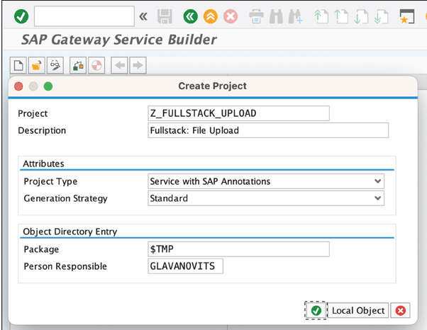
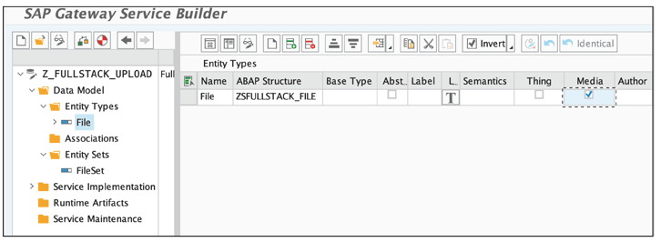

# SAP OData for Media Links (File Upload/Download)

**Media entities and streams are the go-to-way of handling files in an OData Service**

*Thus handling is either available for OData v2/V4 services and can be added to the main frameworks for building OData services for SAP-related services*

-----

SAPUI5 provides designated controls for handling file upload and download. These files are transported as data streams with the help of OData media entities. 

---

Additionally, ABAP RAP for OData V4 offers an easy way of annotating persistent fields to be usede for these media streams. 

Transaction: **SEGW** or **ABAP RAP**

## Media Entities

An OData media entity is a special entity in the data model of an OData service that offers stream methods that must either be implemented manually (**SEGW**) or that are generically provided by a framework (**ABAP RAP**). 

Such entity is flagged in the metadata document of an OData service as streamable (**attribute hasStream is set**) and **must** offer at least the following properties:

* **Content** - the content of the file gets sent, often stored as raw string on a db level
* **MimeType** - using the MIME type, the content type of the file will be persisted
* **FileName** - file name also must be persisted

----
*NOTES: MIME types - internet media type, identifies the content type of data in the internet. When using media entities, this information is sent with all requests and must be persistent on a DB level. A MIME type consists of type and subtype. A type can be an application (for binary data), text (for texts), or image (for pictures). Each type adds subtypes to provide more information, such as application/pdf or text/xml.*


----

## OData V2 (SEGW)

### Perform the necessary on-premise groundwork

1. Corresponding structures and tables must be created
2. DB Table at least two columns: content (XSTRIINGVAL), mime_type (SAEMIME) + ( filename,mandt, id (SYSUUID_C)...)
3. Once table is done, structure must be created.. 1:1 copy of the DB Table


### Create SEGW project, implement necessary functions in the OData Service

1. Transaction SEGW & create new project:

```
Project: Z_FULLSTACK_UPLOAD
Description: Fullstack: File Upload
Project Type: Service with SAP Annotations
Generation Strategy: Standard
Package: <yours-package>
```



2. Import DDIC structure to create entity
3. Choose Primary key of the entity
4. By default, entity types are not created as MEDIA types ... click entity type and select Media CheckBox



5. Save & generate

### Uplaod/Download

1. To implement Upload / Download functionality we first need to redefine **DEFINE** method in the model provider class (in MPC_EXT). This is where we define which entity is a media entity. 

There are 2 required methods for this: 

* **set_as_content_type** -> defines the field that holds the mime type
* **set_as_content_source** -> defines the field that contains the content of the file

```
// Example of implementation

METHOD define. 

DATA: lo_entity TYPE REF TO /iwbep/if_mgw_odata_entity_typ.
DATA: lo_property TYPE REF TO /iwbep/if_mgw_odata_property.

super->define( ).

lo_entity = model->get_entity_type( iv_entity_name = 'File' ).

IF lo_entity IS BOUND. 

lo_property = lo_entity->get_property( iv_property_name = 'MimeType' ).
lo_property->set_as_content_type( ).

lo_property = lo_entity->get_property( iv_property_name = 'Content' ).
lo_property->set_as_content_source( ).

ENDIF.

ENDMETHOD.

```

Now we are ready to implement upload/download functionality.

2 methods: 

* **GET_STREAM**
* **CREATE_STREAM**

2. Implementation of **GET_STREAM**: 

Key is passed via which the corresponding data record is read from table. Then file content is returned in a stream. In addition, a file name can also be returned via HEADER.

```
// implementation example 

METHOD /iwbep/if_mgw_appl_srv_runtime~get_stream.

DATA:   ls_key      TYPE /iwbep/s_mgw_name_value_pair,
        lv_id       TYPE sysuuid_c,
        ls_stream   TYPE ty_s_media_resource, 
        ls_header   TYPE ihttpnvp,
        lv_filename TYPE string,
        ls_file     TYPE zsfullstack_file.
        
        * Read Key
        READ TABLE it_key_tab WITH KEY name = 'Id' INTO ls_key.
        lv_id = ls_key-value.
        * Read file from database
        SELECT SINGLE * FROM zfullstack_file INTO @ls_file WHERE id = @lv_id.
        * Assign values
        ls_stream-value = ls_file-content.
        ls_stream-mime_type = ls_file-mime_type. 
        * Add headers
        ls_header-name = |content-disposition|.
        ls _header-value = inline; filename={ ls_file-file_name }l.
        set_header ( is_header = 1s_header ).
        copy_data_to_ref( EXPORTING is_data = ls_stream CHANGING cr_data = er_stream ).

ENDMETHOD.

```


3. Implementation of **CREATE_STREAM**

File content, MIME type and file name are received. The file name is sent in the SLUG header. If necessary, SLUG could also be used to send other or additional information. 


```
// implementation example of CREATE_STREAM

METHOD /iwbep/if_mgw_appl_srv_runtime~create_stream.

DATA:   ls_file TYPE zsfullstack_file.
        ls_file-id = cl_system_uuid=>create_uuid_c32_static( ).
        ls_file-file_name = iv_slug.
        ls_file-content = is_media_resource-value.
        ls_file-mime_type = is_media_resource-mime_type.
        
        INSERT INTO zfullstack_file VALUES ls_file.
        copy_data_to_ref( EXPORTING is_data = ls_file CHANGING cr_data = er_entity ).

ENDMETHOD.

```

## OData V4 - Media 

The ABAP RESTful application programming model provides the automatic handling of large objects or data streams. For these files to be automatically handled, database fields for the file itself, its MIME type (data type of the file), and the file name are required.

1. we need to add three fields to database table zrap _books, as follows:

```
attachment : abap.rawstring(0);
mimetype : mime_typ;
filename : file01;

```

2. these new field must be added to interface view 

```
...

        @Semantics.largeObject: {
        mimeType: 'MimeType', 
        fileName: 'FileName'
        acceptableMimeTypes: ['image/png', 'image/png', 'application/pdf'], contentDispositionPreference: #ATTACHMENT }
        attachment as Attachment, 
        
        @Semantics.mimeType: true 
        mimetype as MimeType,

...

```


3. To make the newly added fields available for consumption, we need to add them to the field list of the projection view:

```

define root view entity ZRAP_CV_BOOKS as projection on ZRAP_IV_ BOOKS{
        ...
        Attachment, 
        MimeType, 
        FileName,
        ...
｝


```

4. Now we need to enhance the metadata extension of our projection view
```
@EndUserText.label: 'Cover Image'
@UI.identification: [{ position: 70 }]
Attachment;

@Ul.hidden: true
MimeType;

@Ul.hidden: true
FileName;


```


[<- Back to Main](../../README.md)