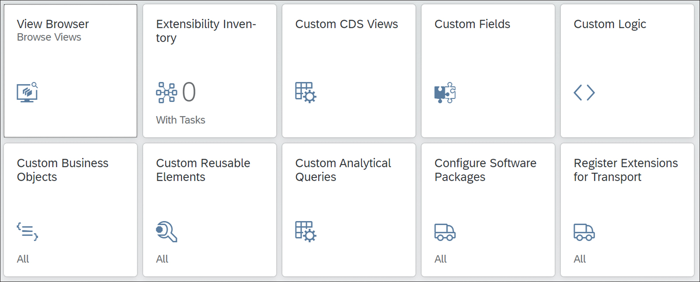

# SAP CDS Extensions


Business software must be extensible to support customer-specific types of data.
In SAP S/4HANA and ABAP-based cloud solutions, extensions of core data services (CDS) views
and view entities are the foundation for extending applications.


In this chapter, we’ll discuss how you can extend standard CDS views with your custom fields and associations “from within.”

To do so, you rely on the inner structure of a CDS view, which isn’t controlled by a stability contract in SAP S/4HANA 2021
yet. Stability contract C1 only addresses the exposed signature or application programming interface (API) of a CDS view
what is visible “from the outside.”

The inner structure of a view, its implementation, isn’t covered by C1.
SAP is considering, however, a stability contract C0, which addresses those parts of the inner structure
that are relevant for extensions with custom fields and associations. In fact,
a preliminary version of the C0 contract is already applied for key user extensions,
but it’s not yet available for developers.

Besides extensions with custom fields and associations, extensions of the metadata of standard fields
and annotations are possible. These CDS metadata extensions enable customers, partners,
or other extenders to add annotations to standard fields of a CDS model or to change existing ones.

## Extension Options

### Key User Extensions - the only way for cloud


With these SAP Fiori apps, you can extend application data with custom fields; include these in CDS views, OData services, and UIs; and define your own business logic for checking the data. The definition of custom CDS views and analytic queries is possible as well. You don’t need an SAP GUI or an Eclipse development environment.

The key user apps can only extend application data and development artifacts (including CDS views) that were prepared and released by SAP for that purpose. The preparation ensures that your extensions are preserved during upgrades. The key user apps and the underlying technology were specifically developed for SAP S/4HANA Cloud. Up to release 2108, they are the only option, but a further option based on the ABAP Development Tools (ADT) is in preparation. The key user apps can be used in an on-premise installation as well.


### Extensions Defined in ABAP Development Tools
You can also leverage the CDS views delivered by SAP in your developments; however, if there is an incompatible change, it may be necessary to adjust your custom views when upgrading to a new version of SAP S/4HANA. We recommend, therefore, using CDS views released by SAP that are expected to be more stable.


## Content

| Topic                                                                       | Description                       |
|-----------------------------------------------------------------------------|-----------------------------------|
| [CDS Entity Extension](#CDS_entity_extensions)                              | CDS Entity Extension              | 
| [Extension of a CDS View Entity](#CDS_view_entity_extension)                | Extension of a CDS View Entity    | 
| [Extension of a CDS View Stack](#CDS_view_stack_extension)                  | Extension of a CDS View Stack     |
| [Indirect CDS View Extensions](#CDS_indirect_extensions)                    | Indirect CDS View Extensions      |
| [Extend the Extension Include View](#CDS_extend_the_extension_include_view) | Extend the Extension Include View |
| [Extension Association](#CDS_extension_association)                         | Extension Association             |


Usage of CDS Entity Extensions


* Not all CDS views delivered by SAP are prepared for indirect CDS view or view entity extensions. 
* Under certain conditions, this isn’t possible, and the need for extensions is sometimes unknown. This section gives an overview of such situations and explains alternative approaches. It also discusses their stability when upgrading to a new software version. The given examples focus on CDS view extensions as most CDS entities delivered by SAP are CDS views. The approaches can similarly be applied to other CDS entities as well.

| Topic                                                                  | Description                    |
|------------------------------------------------------------------------|--------------------------------|
| [Missing Extension Association](#CDS_missing_ext_asoc)                 | Missing Extension Association  |
| [Missing Extension Include View](#CDS_missing_ext_include_view)       | Missing Extension Include View |
| [Missing Foreign Key Fields](#CDS_missing_foreign_key)                | Missing Foreign Key Fields     |
| [Analytical Query Views](#CDS_analytical_query_views)                 | Analytical Query Views         |
| [Extension with Standard Fields](#CDS_extension_with_standard_fields) | Extension with Standard Fields |
| [Extensions of Released CDS Views](#CDS_extension_of_released_cds_views) | Extensions of Released CDS Views                               |
| [Namespace Prefix](#CDS_namespace_prefix)                          |Namespace Prefix|
| [Extensions with Calculated Fields](#CDS_extension_calculated_fields)  |Extensions with Calculated Fields|


--------------
## CDS_entity_extensions

[<- Back to Top](#content)

CDS entity extensions are created in the ADT as CDS data definitions.
They can extend CDS views or entities with fields and associations.
The extension fields and associations can also be annotated in the CDS entity extension.
Each type of CDS entity has its own syntax variant for defining an entity extension:

* For a CDS view: <i>extend view</i>
* For a CDS view entity: <i>extend view entity</i>
* For a CDS abstract entity: <i>extend abstract entity</i>
* For a CDS custom entity: <i>extend custom entity</i>

In this section, we demonstrate the first two variants with examples.

Afterward, we discuss the robustness of an extension for an upgrade and introduce a method to improve it.


[<- Back to Top](#content)


--------

## CDS_view_entity_extension

[<- Back to Top](#content)

The first example adds a custom field and association to view entity ```ZI_SalesOrderItem```.

First define necessary ABAP Dictionary objects:

* Domain: ```ZZPRIORITY```
* Data element: ```ZZPRIORITY```
* Data element: ```ZZPRIORITYTEXT```


```
/// View Entity for Domain Fixed Values

@AccessControl.authorizationCheck: #NOT_REQUIRED
@EndUserText.label: 'Priority'
@ObjectModel.representativeKey: 'Priority'
@Search.searchable: true
define view entity ZI_Priority as select from dd07l
  association [0..*] to ZI_PriorityText as _Text on $projection.Priority = _Text.Priority
{
     @ObjectModel.text.association: '_Text'
     key cast( dd07l.domvalue_l as zzpriority ) as Priority,
     
     @Consumption.hidden: true
     @Search.defaultSearchElement: true
     @Search.ranking: #HIGH
     dd07l.domvalue_l                       as DomainValue,
     
     _Text
} where dd07l.domname  = 'ZZPRIORITY'
  and   dd07l.as4local = 'A'
  and   dd07l.as4vers  = '0000' 
```

and
```
/// View Entity for Domain Fixed Value Texts
@AccessControl.authorizationCheck: #NOT_REQUIRED
@EndUserText.label: 'Priority Text'
@ObjectModel.dataCategory: #TEXT
@ObjectModel.representativeKey: 'Priority'
@Search.searchable: true
define view entity ZI_PriorityText as select from dd07t
  association [1..1] to ZI_Priority as _Priority on $projection.Priority = _Priority.Priority
  association [0..1] to I_Language as _Language on $projection.Language = _Language.Language
{     
@ObjectModel.foreignKey.association: '_Language'
      @Semantics.language: true
      key cast( dd07t.ddlanguage as spras preserving type ) as Language,
    
      @ObjectModel.foreignKey.association: '_Priority'
      @ObjectModel.text.element: ['PriorityText']
      key cast( dd07t.domvalue_l as zzpriority ) as Priority,
      
      @Search.defaultSearchElement: true
      @Search.fuzzinessThreshold: 0.8
      @Search.ranking: #HIGH
      @Semantics.text: true
      cast( dd07t.ddtext as zzprioritytext preserving type ) as PriorityText,
      _Priority,
      _Language
} where dd07t.domname = 'ZZPRIORITY'
  and   dd07t.as4local = 'A'
  and   dd07t.as4vers  = '0000' 
```

Now make sure that the database table is extensible and extend table.

```
/// Name of the DB table is: zzsalesorderitem 

@EndUserText.label : 'Extensions for ZZSALESORDERITEM'
@AbapCatalog.enhancement.category : #NOT_EXTENSIBLE
extend type zzsalesorderitem with zzsalesorderitem_extension {
  zzpriority : zzpriority;
} 
```

And this is what we want to extend:

```
@AccessControl.authorizationCheck: #CHECK
@EndUserText.label: 'Sales Order Item'
define view entity ZI_SalesOrderItem as select from zzsalesorderitem
{  key salesorder          as SalesOrder,
   key salesorderitem      as SalesOrderItem,
       product             as Product,
       @Semantics.quantity.unitOfMeasure: 'OrderQuantityUnit'
       orderquantity       as OrderQuantity,
       orderquantityunit   as OrderQuantityUnit,
       @Semantics.amount.currencyCode: 'TransactionCurrency'
       netamount           as NetAmount,
       transactioncurrency as TransactionCurrency,
       creationdate        as CreationDate
} 
```

View entity extension ZX_SALESORDERITEM in Listing 14.6 adds field ZZPriority and defines and adds new association _ZZPriority. Moreover, it annotates extension field ZZPriority with a foreign key association.
```
extend view entity ZI_SalesOrderItem with ZX_SALESORDERITEM 
    association [0..1] to ZI_Priority as _ZZPriority on $projection.ZZPriority = _ZZPriority.Priority
{ 
    @ObjectModel.foreignKey.association: '_ZZPriority'
    zzsalesorderitem.zzpriority as ZZPriority,
    _ZZPriority
}
```


Note the following key points regarding extending CDS view entities:
* Multiple independent extensions for the same CDS entity are possible.
* Ensure that you explicitly specify the data source of an extension field, ZZSALESORDERITEM, in the example.
* Be sure to prefix any extension field or extension association with ZZ or your own namespace prefix to avoid name collisions with elements added by SAP in a future upgrade.
* You can define extension fields such as defining regular fields in a CDS view entity.
* You can define extension fields by following associations with a target cardinality of at most 1.
* You can define extension fields as calculated fields.
* In a view entity extension, you can add new associations without adding an extension field.

[<- Back to Top](#content)


------

## CDS_view_stack_extension

[<- Back to Top](#content)

We want to extend standard SAP view ```I_SalesOrderItemCube``` with the priority field that we already used in the first example.

We start with the extension of the database table ```VBAP```.

Note that the activation of the table extension may take some time as table ```VBAP``` is frequently used in the system.

``` 
@EndUserText.label : 'Extensions for table VBAP'
@AbapCatalog.enhancement.category : #NOT_EXTENSIBLE
extend type vbap with zzvbap_extension {
    zzpriority : zzpriority;
} 
```

[<- Back to Top](#content)

-----

## CDS_indirect_extensions

[<- Back to Top](#content)


For the key user apps of SAP S/4HANA Cloud, SAP developed an alternative approach that avoids reworking extensions and ensures smooth upgrades. You can benefit from that approach if you extend a CDS view or view entity that is prepared for it, even if you don’t want to use the key user apps.


The basic idea of indirect CDS view extensions is the introduction of a special CDS view, the extension include view, as the data source for the extension fields of a table. This view is complemented by extension associations to the extension include view from all views that could be extended by custom fields appended to this table. These associations are typically called _Extension.

Instead of extending all views in the view stack, only the extension include view and top view I_SalesOrderItemCube are extended

The extension include view serves as a data source for the extension field that is included in the cube view via the extension association. The replacement of an intermediate view during upgrade has no impact on the extension because the intermediate views are no longer data sources for the extension. The issues of the direct view extension don’t exist with this approach, as SAP keeps the extension include view and the associations to it stable to ensure the stability of extensions defined by the key user apps.


### Stability of Indirect CDS View Extension

An indirect CDS view extension is stable if the extension include view and the extension association remain unchanged. The view doesn’t need to be released with stability contract C1. If the view is offered for field extensions in the key user apps, the stability of its extension include view and its extension association is controlled by SAP internal checks.
View I_SalesOrderItemCube in our examples is both released and available for field extensions in the key user apps. You can, for example, define your own analytical queries for this cube view, as explained in Chapter 10, Section 10.3, and use your extension field ZZPriority in analytics. Your previously defined view entity ZI_Priority is used as a dimension in the extended cube, as you’ve associated and annotated it as a foreign key association. Thanks to your text view, your priority texts defined in the ABAP Data Dictionary are shown as well.


[<- Back to Top](#content)

-----

## CDS_extend_the_extension_include_view

[<- Back to Top](#content)


Let’s examine a concrete view definition for an indirect CDS view extension. Listing 14.9 shows the essential part of extension include view E_SalesDocumentItemBasic for database table VBAP as it’s delivered by SAP.
@AbapCatalog.sqlViewName: 'ESDSLSDOCITMBSC'
@EndUserText.label: 'Extension view for VBAP'
@VDM.viewType: #EXTENSION
define view E_SalesDocumentItemBasic as select from vbap as Persistence
{ key Persistence.vbeln as SalesDocument,
key Persistence.posnr as SalesDocumentItem
}

The extension include view only has the key fields of the table as fields, and it always uses alias Persistence for its data source, the table.

As a prerequisite for an indirect CDS view extension, the view must have fields that correspond to the key fields of the extension include view. Otherwise, the extension association can’t be defined. These fields must not be calculated fields, as an association defined on calculated fields can’t be used in a path expression of the view itself or in an extension of this view.

Now, define a CDS view extension of the extension include view. Proceed just like the definition of a CDS view and create a data definition in Eclipse. Enter the name “ZX_E_SalesDocItemBasic_Prio” and an appropriate description. Enter the source code shown in Listing 14.11 and activate it. The activation of a CDS view extension causes the activation of the following: the extension include view, all views that associate to it, and all views consuming them. This can take some time to complete.
```
@AbapCatalog.sqlViewAppendName: 'ZXESDIBPRIO'
extend view E_SalesDocumentItemBasic with ZX_E_SalesDocItemBasic_Prio
association [0..1] to ZI_Priority as _ZZPriority
on $projection.ZZPriority = _ZZPriority.Priority
{ @ObjectModel.foreignKey.association: '_ZZPriority'
Persistence.zzpriority as ZZPriority,
_ZZPriority
}
```

Multiple CDS view extensions for the same CDS view are possible. A CDS view extension consists of the following parts:
* Annotation @AbapCatalog.sqlViewAppendName defines the name of an append structure in the ABAP Data Dictionary. This is appended to the SQL view of the extended view (in this example, view ESDSLSDOCITMBSC). This annotation is only necessary for view extensions; other entity extensions don’t need it.
* Similar to CDS views, an association can be defined as well. In the example, this is foreign key association _ZZPriority to the entity view of the extension field. Note prefix ZZ avoids collision with SAP names.
* In the projection list, you added extension field ZZPriority with a namespace prefix (ZZ) to avoid name collisions with SAP fields. You should always add the data source alias Persistence.
* The extension field can also be annotated, and the association defined in the CDS view extension can be exposed as well. Note that at least one extension field is mandatory.


The extended view itself does not show the extension elements in the Eclipse editor, but it indicates the existence of additional information by an icon

to the left of keyword define. Clicking the icon shows a list of defined extensions. The CDS Navigator or the Relation Explorer window in Eclipse, available as tabs in the upper-left area of the ABAP perspective, show the extensions of view E_SalesDocumentItemBasic together with other software artifacts relating to the view, such as access controls or generated OData services.


The key user apps generate CDS view extensions similar to the one you just defined manually. A mixture of manual and key user app extensions is possible.

[<- Back to Top](#content)

------

## CDS_extension_association

[<- Back to Top](#content)


In the next step, you extend view I_SalesOrderItemCube by leveraging its extension association. The definition of this association was already given in Listing 14.10. You can use it to define CDS view extension ZX_I_SalesOrderItemCube_Prio for I_SalesOrderItemCube

```
@AbapCatalog.sqlViewAppendName: 'ZXISOICPRIO'
extend view I_SalesOrderItemCube with ZX_I_SalesOrderItemCube_Prio
association [0..1] to ZI_Priority as _ZZPriority
on $projection.zzPriority = _ZZPriority.Priority
{ @ObjectModel.foreignKey.association: '_ZZPriority'
_Extension.ZZPriority,
_ZZPriority
}
```

The extension field is specified by path expression _Extension.ZZPriority and technically added to the cube view by a join with the extension include view. As both these views are based on table VBAP, this join is a self-join of the table, which can be executed in an optimized way by the SAP HANA database.

To remove a CDS view extension, you must delete the data definition of the CDS view extension completely. This deletion removes the extension fields from the extended view and activates the view, which can take some time to complete.


[<- Back to Top](#content)


------

## CDS_missing_ext_asoc

[<- Back to Top](#content)

Consider the following situation:
* You want to include a custom field in a CDS view, but there is no extension association _Extension in this view.
* An appropriate extension include view exists, and you’ve already extended it with your custom field.
* The CDS view that you want to extend has fields that correspond to the key fields of the extension include view, and these foreign key fields weren’t calculated in the view but directly consumed from a data source.
  In cases like these, in your CDS extend view, you can define your own custom association _ZZExtension as a substitute for the extension association and include the extension field via this association. The CDS extend view could look like :
```
AbapCatalog.sqlViewAppendName: 'ZXMEAPRIO'
extend view <MissingExtensionAssociation>
with ZX_MissingExtAssociation_Prio
    association [0..1] to E_SalesDocumentItemBasic as _ZZExtension
        on  $projection.<SD_Field>  = _ZZExtension.SalesDocument
        and $projection.<SDI_Field> = _ZZExtension.SalesDocumentItem
{ 
    _ZZExtension.ZZPriority
}
```
This extension is stable if the view to be extended keeps the foreign key fields on which the custom association is defined and doesn’t introduce a calculation for them. If the view is released, you can expect that it will keep the used foreign key fields. There is a small remaining risk that a released view might calculate fields in a new software version that were projected from a data source before. Such a change is an internal implementation aspect of a released view and not forbidden, but it’s rather unlikely


After SAP offers an extension association for the view, you can replace your custom association with extension association _Extension of the SAP standard in your CDS extend view (e.g., in Listing 14.14). However, you can also keep your own extension association—parallel associations with different names can coexist.


[<- Back to Top](#content)


------

## CDS_missing_ext_include_view

[<- Back to Top](#content)


Maybe SAP doesn’t (yet) provide an extension include view for the table with your extension fields. To keep your extensions as stable as possible, you can apply the concept of indirect extensions yourself. Define your own extension include view, and use your own extension association.
If extension include view E_SalesDocumentItemBasic would not exist, a replacement could look like Listing 14.15. You can include your custom extension fields directly in this view.
```
@AbapCatalog.sqlViewName: 'ZESDSLSDOCITMBSC'
@AbapCatalog.compiler.compareFilter: true
@AbapCatalog.preserveKey: true
@EndUserText.label: 'Custom Extension Include View for VBAP'
define view ZE_SalesDocumentItemBasic as select from vbap as Persistence
{ 
    key Persistence.vbeln      as SalesDocument,
    key Persistence.posnr      as SalesDocumentItem,
    Persistence.zzpriority as ZZPriority
}  
```

With this approach, you avoid the extension of complex view stacks and reduce the risk of incompatible changes to the concrete extension points. If SAP delivers an extension include view in a later release, you can migrate your extensions to that.

[<- Back to Top](#content)


------

## CDS_missing_foreign_key

[<- Back to Top](#content)


If you want to add a custom field to a CDS view that doesn’t have foreign key fields for the table containing the extension fields, an indirect CDS view extension isn’t possible. Such a situation may arise if only selected fields are projected in a view stack or if data is aggregated.
In this case, you can add the custom field to the nearest CDS view in the view stack that still contains the foreign key fields. Starting from this view, use direct CDS view extensions. The ABAP help documentation for CDS (http://s-prs.co/v529420) explains in detail how to handle aggregating views or unions. Note, however, that there is a higher risk for instabilities, as explained in Section 14.2.2.


[<- Back to Top](#content)


------

## CDS_analytical_query_views

[<- Back to Top](#content)

In analytical queries, fields that are added from associated dimension views have only limited capabilities: they can only be displayed.

If you want to group or filter by custom fields, you must extend the primary data source of the query, the cube or dimension view, with your custom fields and select them from the data source into the query view. Don’t forget to add the foreign key association to the related dimension views as well.
Apply a direct CDS view extension to include your fields in the analytical query. Figure 14.5 illustrates the resulting model.
Direct CDS view extension ZX_C_SALESORDERITEMQRY_PRIO of the analytical query is shown in Listing 14.16. Note that you can also use annotations to control the presentation of the extension fields.

```
@AbapCatalog.sqlViewAppendName: 'ZXCSOIQPRIO'
extend view C_SalesOrderItemQry with ZX_C_SalesOrderItemQry_Prio
{ 
    @AnalyticsDetails.query.display: #KEY_TEXT
    ZZPriority
}
```
If SAP doesn’t change the query to select from a different cube view, the direct view extension is stable.

As an alternative to extending the analytical query, you can copy the SAP query to a custom query, add your custom fields, and use it. If the primary data source of the query, the cube view, was released by SAP, this approach is more robust.


[<- Back to Top](#content)


------

## CDS_extension_with_standard_fields

[<- Back to Top](#content)

With a CDS view extension, you can add not only custom fields to a CDS view but also technically standard fields from all data sources on which the view is defined. This offers great flexibility for providing additional fields that were omitted by SAP. You’re not restricted to the fields of the primary data source, so you can use all data sources that are joined to the primary data source, as well as follow any association to add further fields.
This flexibility involves some risks, however:
* If you use associations with higher cardinality, the number of result rows could be affected, as well as all aggregated measures based on the extended view. Use appropriate filters when following associations in such cases.
* Used associations imply joins on the related SQL views. These increase the technical complexity of the view definition and can have a negative impact on the runtime behavior. Note that along with the extended view itself, other views using it as a data source are also affected.
* SAP has omitted some standard fields for data protection reasons. If you add relevant fields, you must ensure data protection and access rules yourself.
* SAP can change the inner structure of a CDS view in a new software version. This is even possible for views released with stability contract C1 and creates a notable risk for your extension.The following changes of the view implementation, for example, can invalidate an extension with standard fields or via associations:
    * A data source is changed incompatibly; for example, some fields or associations are deleted or renamed.
    * A data source of the extended view is replaced with a different one in a new software version.
    * A data source gets a new alias name.
    * A naming conflict exists between data sources that requires the explicit specification of the data source in the projection list.
      For selected views, the key user apps offer extension options with standard fields from data sources of the view and ensure stability by specific checks. In general, though, there is no guarantee for stability. For released CDS views, however, extension options with lower stability risk exist that will be presented in the next section.

[<- Back to Top](#content)


------

## CDS_extension_of_released_cds_views

[<- Back to Top](#content)

Let’s assume that you want to extend a CDS view released with stability contract C1 with standard fields of its data sources or via an association. All exposed fields of the view and exposed associations to other released views are stable, but they aren’t relevant for your extension. First, the exposed fields are already available, and you don’t need to add them as extension fields, and secondly, CDS view extensions are defined within the implementation of a view, not on its exposed API. CDS view extensions can only use fields and associations of the view’s data sources as well as associations defined in the view itself. However, these elements belong to the view’s internal implementation, which isn’t covered by the stability contract for released views. Therefore, the risks listed in Section 14.3.5 also exist for extensions that directly use the fields and associations of the view’s data sources or SAP standard associations.
Fortunately, you can define your own custom associations in the CDS extend view. To use them for your extensions with standard fields, they must follow these guidelines:
* Must be defined in your CDS view extension
* Must have a released view as target
* Must have a cardinality of [0..1] or [1..1]
* Must be defined on exposed fields of the extended view via $projection
* Must be defined on exposed fields that aren’t calculated locally in the extended view
  By leveraging these associations, you can include standard fields from released views in your CDS view extension. Listing 14.17 shows how you can extend the example from Section 14.2.5 with a custom association to a released view that you use to add a standard field to your extension.

```
@AbapCatalog.sqlViewAppendName: 'ZXISOICPRIO'
extend view I_SalesOrderItemCube with ZX_I_SalesOrderItemCube_Prio
    association [0..1] to Z_Priority as _ZZPriority
        on $projection.zzpriority = _ZZPriority.Priority
    association [0..1] to I_Customer as _ZZSoldToParty
        on $projection.soldtoparty = _ZZSoldToParty.Customer
    association [0..1] to I_Country  as _ZZSoldToPartyCountry
        on $projection.ZZSoldToPartyCountry = _ZZSoldToPartyCountry.Country
{ 
    @ObjectModel.foreignKey.association: '_ZZPriority'
    _Extension.ZZPriority,
    _ZZPriority,
    
    @ObjectModel.foreignKey.association: '_ZZSoldToPartyCountry'
    _ZZSoldToParty.Country as ZZSoldToPartyCountry,
    _ZZSoldToPartyCountry
}
```
The example adds the country of the sold-to-party as an extension field to cube view I_SalesOrderItemCube by leveraging association _ZZSoldToParty to view I_Customer defined in the view extension. This approach is possible because the association can be defined on exposed field SoldToParty by using language element $projection, which is used to address exposed fields of the view. Because I_SalesOrderItemCube is released, the exposed fields and the association definition are stable.


[<- Back to Top](#content)


------

## CDS_namespace_prefix

[<- Back to Top](#content)

As in other extensions, take care to use a namespace prefix for extensions with standard fields and associations. SAP could add these standard fields in a later release, and you must avoid naming collisions.


Even with this approach, a risk remains under very constrictive conditions during upgrade to a new software version. If one of the $projection fields in the definition of the custom association you use for retrieving a standard field is calculated in a new release, this leads to a syntax error as associations defined with calculated fields must not be used within the same view definition. Compared with the risks described in the Section 14.3.5, however, we expect a much higher stability.


[<- Back to Top](#content)


------

## CDS_extension_calculated_fields

[<- Back to Top](#content)

CDS entity extensions also support the calculation of fields. Technically, all fields and associations of all data sources of the view as well as the view parameters are available as input values for the calculation. However, all risks listed in Section 14.3.5 exist for these calculated fields as well. You can minimize the risks for extensions of released views if you proceed as described in Section 14.3.6 and only use fields as input values that can be retrieved via custom associations or via the extension association. It’s safe to use parameters of released views because these fall under stability contract C1. You can extend the example of Listing 14.17, for example, by a calculated field as follows:
```
concat(_Extension.ZZPriority, _ZZSoldToParty.Country) as ZZCalculatedField
```
In general, the stability risk of calculated fields directly results from the individual risks of the fields or parameters used.


[<- Back to Top](#content)


------
